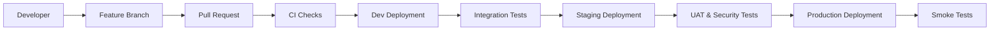

# Enterprise CDK Constructs Library

[](https://github.com/your-org/mcp-cdk-ddk/actions)
[](https://github.com/your-org/mcp-cdk-ddk/actions)
[](https://your-org.github.io/mcp-cdk-ddk)
[](https://opensource.org/licenses/MIT)
[](docs/constructs/)
[](docs/production/)

A comprehensive DevSecOps platform built with AWS CDK for data engineering and AI/ML workloads. This platform provides enterprise-grade infrastructure, security, compliance, and operational excellence out of the box.

## 🚀 Quick Start

```bash
# Install the CLI
pip install ddk-cli

# Initialize configuration
ddk-cli init

# Create your first data pipeline project
ddk-cli create-project my-pipeline --template data-pipeline

# Deploy to AWS
cd my-pipeline
ddk-cli deploy --env dev
```

## ✨ Key Features

### 🛡️ **Security by Design**
- **Comprehensive Scanning**: SAST, DAST, dependency vulnerabilities, secrets detection
- **Compliance Automation**: SOC 2, ISO 27001, GDPR compliance checking
- **Encryption**: End-to-end encryption at rest and in transit
- **Access Control**: IAM least privilege with fine-grained permissions
- **Network Security**: VPC isolation, security groups, and WAF protection

### 🤖 **AI-Powered Development**
- **Code Generation**: Intelligent template-based code generation
- **Error Analysis**: Automated error detection and remediation suggestions
- **Optimization**: Performance and cost optimization recommendations
- **Documentation**: Auto-generated documentation and compliance reports

### 🔄 **Multi-Environment CI/CD**
- **Automated Pipelines**: GitHub Actions with dev → staging → prod flow
- **Quality Gates**: Automated testing, security scanning, and approval processes
- **Rollback**: Automated rollback on deployment failures
- **Infrastructure as Code**: Complete AWS CDK implementation

### 📊 **Comprehensive Monitoring**
- **Real-time Dashboards**: CloudWatch dashboards with custom metrics
- **Alerting**: Automated alerting for failures and performance issues
- **Cost Optimization**: Cost monitoring and optimization recommendations
- **Health Checks**: Automated health monitoring and remediation

### 🎯 **Self-Service Platform**
- **Web Portal**: Self-service project creation and management
- **CLI Tools**: Rich command-line interface for developers
- **Templates**: Extensible project templates for common patterns
- **Documentation**: Comprehensive documentation with tutorials

## 📁 Project Structure

```text
mcp-cdk-ddk/
├── infrastructure/          # AWS CDK infrastructure code
│   └── constructs/         # Enterprise CDK constructs library (21 constructs)
│       ├── common/         # Common utilities and base classes
│       │   ├── base.py     # BaseConstruct with convention enforcement
│       │   ├── conventions.py  # Naming, tagging, and validation utilities
│       │   ├── mixins.py   # Reusable functionality mixins
│       │   └── types.py    # Common type definitions
│       ├── data_ingestion/ # Data ingestion constructs (7 constructs)
│       │   ├── raw_data_ingestion.py      # S3 → Lambda → Glue pipeline
│       │   ├── streaming_ingestion.py     # Kinesis → Lambda → S3
│       │   ├── api_ingestion.py           # API Gateway → Lambda → S3
│       │   ├── database_ingestion.py      # RDS/DynamoDB → DMS → S3
│       │   ├── file_ingestion.py          # S3 event-driven processing
│       │   ├── batch_ingestion.py         # Scheduled AWS Batch processing
│       │   └── realtime_ingestion.py      # Kinesis Data Firehose
│       ├── infrastructure/ # Infrastructure constructs (7 constructs)
│       │   ├── vpc_construct.py           # Multi-AZ VPC with endpoints
│       │   ├── lambda_construct.py        # Enterprise Lambda functions
│       │   ├── dynamodb_construct.py      # DynamoDB with auto-scaling
│       │   ├── ec2_construct.py           # Auto-scaling groups
│       │   ├── rds_construct.py           # Multi-AZ databases
│       │   ├── ecs_construct.py           # Fargate/EC2 services
│       │   └── msk_construct.py           # Managed Kafka (shared)
│       ├── messaging/      # Messaging constructs (4 constructs)
│       │   ├── msk_construct.py           # Managed Kafka with encryption
│       │   ├── kinesis_construct.py       # Data streams with analytics
│       │   ├── sqs_construct.py           # Standard/FIFO queues with DLQ
│       │   └── sns_construct.py           # Multi-protocol notifications
│       └── ai_ml/          # AI/ML constructs (3 constructs)
│           ├── bedrock_construct.py       # Amazon Bedrock with guardrails
│           ├── sagemaker_construct.py     # Complete ML lifecycle
│           └── model_deployment_construct.py  # A/B testing & canary
├── platform_tools/        # Platform services and tools (renamed from platform)
│   ├── cli/                # Project generator CLI
│   ├── portal/             # Self-service web portal
│   └── ai-tools/           # AI-powered development tools
├── docs/                   # Comprehensive documentation
│   ├── conventions/        # Convention documentation
│   │   ├── aws-resource-naming.md         # Naming conventions
│   │   ├── aws-resource-tagging.md        # Tagging strategy
│   │   └── validation-framework.md       # Validation framework
│   ├── constructs/         # Construct documentation
│   ├── security/           # Security best practices
│   └── production/         # Production deployment guides
├── tests/                  # Comprehensive test suites
│   ├── unit/               # Unit tests including convention tests
│   ├── integration/        # Integration tests
│   └── security/           # Security and compliance tests
├── scripts/                # Deployment and utility scripts
└── .github/workflows/      # CI/CD workflows
    └── smoke/              # Smoke tests
```

## 🛠️ Installation

### Prerequisites
- Python 3.9+
- Node.js 18+
- AWS CLI configured
- AWS CDK CLI installed

### Installation Steps

```bash
# Clone the repository
git clone https://github.com/your-org/mcp-cdk-ddk.git
cd mcp-cdk-ddk

# Install dependencies
pip install -r requirements.txt

# Install development dependencies (optional)
pip install -r requirements-dev.txt

# Install the CLI tool
pip install -e .
```
- AWS CDK CLI installed
- Docker (for local development)

### Installation

1. **Clone and setup the repository:**
```bash
git clone <repository-url>
cd mcp-cdk-ddk
python -m venv venv
source venv/bin/activate  # On Windows: venv\Scripts\activate
pip install -r requirements.txt
```

2. **Install AWS CDK:**
```bash
npm install -g aws-cdk
cdk bootstrap
```

3. **Deploy the platform:**
```bash
# Deploy to development environment
cdk deploy --all --profile dev

# Deploy to production (requires approval)
cdk deploy --all --profile prod --require-approval=broadening
```

### Creating Your First Data Pipeline

```bash
# Use the CLI tool to create a new project
ddk-cli create-project my-data-pipeline --template data-pipeline
cd my-data-pipeline
ddk-cli deploy --env dev
```

## 🏗️ Architecture

### Infrastructure Components

The platform consists of six main CDK stacks that work together to provide a complete DevSecOps solution:

#### 🏛️ Core Infrastructure Stack
- **VPC**: Multi-AZ VPC with public, private, and isolated subnets
- **S3**: Data lake, artifacts, and logs buckets with lifecycle policies
- **KMS**: Encryption keys for data protection
- **IAM**: Least-privilege roles and policies
- **VPC Endpoints**: Secure access to AWS services

#### 🛡️ Security Stack
- **Security Groups**: Network-level access control for all tiers
- **WAF**: Web Application Firewall with AWS managed rules
- **GuardDuty**: Threat detection and monitoring
- **Config**: Compliance monitoring and configuration management
- **CloudTrail**: Audit logging and compliance tracking

#### 🔄 Data Pipeline Stack
- **Lambda**: Serverless data processing functions
- **Glue**: Data cataloging and ETL jobs
- **Step Functions**: Workflow orchestration
- **EventBridge**: Event-driven processing
- **RDS**: Metadata and configuration storage

#### 📊 Monitoring Stack
- **CloudWatch**: Metrics, logs, and dashboards
- **SNS**: Alerting and notifications
- **Custom Metrics**: Application-specific monitoring
- **Cost Optimization**: Usage and cost tracking

#### 🌐 Portal Stack
- **CloudFront**: Global content delivery
- **S3**: Static website hosting
- **API Gateway**: RESTful APIs
- **ECS**: Containerized backend services
- **ALB**: Load balancing and health checks

#### 🤖 AI Tools Stack
- **Bedrock Integration**: AI-powered code generation
- **DynamoDB**: Template and session storage
- **API Gateway**: RESTful API for AI services
- **Lambda Functions**: AI processing logic

## 🔧 Usage

### CLI Commands

```bash
# Initialize CLI configuration
ddk-cli init

# Create a new project
ddk-cli create-project my-pipeline --template data-pipeline

# List available templates
ddk-cli templates

# Deploy project
ddk-cli deploy --env dev

# Check project status
ddk-cli status --env dev

# View logs
ddk-cli logs --env dev --follow

# Destroy infrastructure
ddk-cli destroy --env dev
```

### Security Scanning

```bash
# Run comprehensive security scan
python security/scanner.py scan . --type all --output security-report.json

# Run specific scan types
python security/scanner.py scan . --type code      # SAST scanning
python security/scanner.py scan . --type infra     # Infrastructure scanning
python security/scanner.py scan . --type deps      # Dependency scanning
python security/scanner.py scan . --type secrets   # Secrets detection
```

### Compliance Checking

```bash
# Check SOC 2 compliance
python security/compliance.py check --framework SOC2

# Check multiple frameworks
python security/compliance.py check --framework SOC2 --framework ISO27001 --framework GDPR

# Generate compliance report
python security/compliance.py check --output compliance-report.html --format html
```

## 🛡️ Security & Compliance

### Security Features

- **🔐 Encryption**: All data encrypted at rest and in transit using AWS KMS
- **🌐 Network Isolation**: VPC with private subnets and security groups
- **🔑 Access Control**: IAM roles with least-privilege principles
- **🔒 Secrets Management**: AWS Secrets Manager integration
- **🔍 Vulnerability Scanning**: Automated dependency and code scanning
- **🚨 Threat Detection**: GuardDuty integration for real-time monitoring

### Compliance Frameworks

#### SOC 2 Type II
- ✅ Access controls and user management
- ✅ System monitoring and logging
- ✅ Change management processes
- ✅ Data protection and privacy
- ✅ Incident response procedures

#### ISO 27001
- ✅ Information security policies
- ✅ Risk management processes
- ✅ Asset management and inventory
- ✅ Access control management
- ✅ Cryptographic controls

#### GDPR
- ✅ Data protection by design
- ✅ Privacy impact assessments
- ✅ Data subject rights management
- ✅ Breach notification procedures
- ✅ International data transfers

## 📊 Monitoring & Observability

### Real-time Dashboards
- **Infrastructure Metrics**: EC2, Lambda, RDS, S3 usage and performance
- **Application Metrics**: Custom business metrics and KPIs
- **Security Metrics**: WAF blocks, GuardDuty findings, compliance status
- **Cost Metrics**: Usage patterns and cost optimization opportunities

### Intelligent Alerting
- **🚨 Critical Alerts**: System failures, security incidents, compliance violations
- **⚠️ Warning Alerts**: Performance degradation, cost threshold breaches
- **ℹ️ Info Alerts**: Deployment notifications, maintenance windows

### Comprehensive Logging
- **Application Logs**: Structured logging with correlation IDs
- **Infrastructure Logs**: VPC Flow Logs, CloudTrail audit logs
- **Security Logs**: WAF logs, GuardDuty findings, access logs
- **Compliance Logs**: Configuration changes, policy violations

## 🧪 Testing Strategy

### Automated Testing Pipeline

```bash
# Unit tests
pytest tests/unit/ -v --cov=infrastructure --cov=platform

# Integration tests
pytest tests/integration/ -v

# Infrastructure tests
pytest tests/infrastructure/ -v

# Security tests
python security/scanner.py scan . --type all

# Smoke tests (post-deployment)
pytest tests/smoke/ -v --env dev
```

### Quality Gates
- **Pre-commit Hooks**: Code quality and security checks
- **CI Pipeline**: Automated testing on every commit
- **Security Scanning**: SAST, DAST, dependency vulnerability checks
- **Infrastructure Validation**: CDK synthesis and security validation

## 🚀 Deployment Strategy

### Multi-Environment Pipeline



### Environment Configuration

| Environment | Purpose | Approval Required | Auto-Deploy |
|-------------|---------|-------------------|-------------|
| **Development** | Rapid iteration and testing | No | Yes |
| **Staging** | Production-like validation | Manual | No |
| **Production** | Live environment | Manual + Security Review | No |

### Deployment Commands

```bash
# Deploy to development (automatic)
ddk-cli deploy --env dev

# Deploy to staging (requires approval)
ddk-cli deploy --env staging

# Deploy to production (requires manual approval + security review)
ddk-cli deploy --env prod --approve
```

## 🔧 Development

### Local Development Setup
```bash
# Install development dependencies
pip install -r requirements-dev.txt

# Run tests
pytest tests/

# Run security scans
bandit -r infrastructure/ platform/
safety check

# Format code
black .
isort .
```

### Infrastructure Development
```bash
# Synthesize CloudFormation templates
cdk synth

# Deploy specific stack
cdk deploy DataPipelineStack

# View differences
cdk diff
```

## 📊 Monitoring & Observability

- **CloudWatch Dashboards**: Real-time metrics and logs
- **Automated Alerting**: Intelligent alert routing with escalation
- **Cost Monitoring**: Resource usage and optimization recommendations
- **Data Quality**: ML-based anomaly detection
- **Performance**: Application and infrastructure monitoring

## 🔒 Security

- **IAM**: Least-privilege access with automated role management
- **Encryption**: Data encrypted at rest and in transit
- **Scanning**: Automated SAST/DAST in CI/CD pipeline
- **Compliance**: Automated policy validation and audit logging
- **Vulnerability Management**: Dependency scanning and remediation

## 📚 Documentation

- [Getting Started Guide](docs/getting-started.md)
- [Architecture Overview](docs/architecture.md)
- [Security Best Practices](docs/security.md)
- [API Documentation](docs/api.md)
- [Troubleshooting](docs/troubleshooting.md)

## 🤝 Contributing

Please read our [Contributing Guide](CONTRIBUTING.md) for details on our code of conduct and the process for submitting pull requests.

## 📄 License

This project is licensed under the MIT License - see the [LICENSE](LICENSE) file for details.

## 🆘 Support

- **Documentation**: [docs/](docs/)
- **Issues**: GitHub Issues
- **Discussions**: GitHub Discussions
- **Emergency**: Contact the platform team
