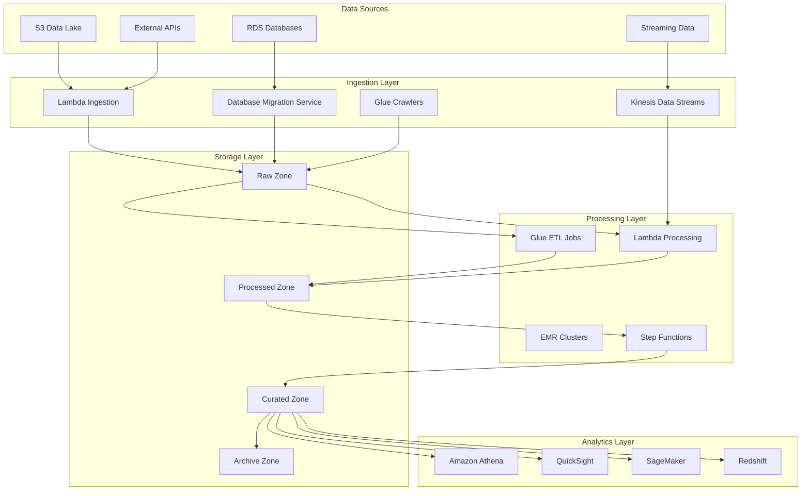

# Data Pipeline Architecture

Comprehensive overview of the data pipeline architecture, patterns, and implementation details for the DevSecOps Platform.

## Pipeline Architecture Overview

The platform implements a modern, cloud-native data pipeline architecture that supports both batch and streaming data processing with built-in security, monitoring, and governance.



## Data Lake Architecture

### 1. Multi-Zone Data Lake

The platform implements a four-zone data lake architecture:

#### Raw Zone
- **Purpose**: Store data in its original format
- **Retention**: 90 days
- **Format**: Original format (CSV, JSON, Parquet, etc.)
- **Access**: Restricted to data engineers

```python
# Raw zone S3 bucket configuration
raw_bucket = s3.Bucket(
    self,
    "RawDataBucket",
    bucket_name=f"{project_name}-raw-{environment}",
    encryption=s3.BucketEncryption.S3_MANAGED,
    block_public_access=s3.BlockPublicAccess.BLOCK_ALL,
    versioning=True,
    lifecycle_rules=[
        s3.LifecycleRule(
            id="RawDataLifecycle",
            enabled=True,
            transitions=[
                s3.Transition(
                    storage_class=s3.StorageClass.INFREQUENT_ACCESS,
                    transition_after=Duration.days(30)
                ),
                s3.Transition(
                    storage_class=s3.StorageClass.GLACIER,
                    transition_after=Duration.days(90)
                )
            ]
        )
    ]
)
```

#### Processed Zone
- **Purpose**: Store cleaned and validated data
- **Retention**: 1 year
- **Format**: Standardized format (Parquet)
- **Access**: Data engineers and analysts

#### Curated Zone
- **Purpose**: Store business-ready, aggregated data
- **Retention**: 7 years
- **Format**: Optimized format (Parquet with partitioning)
- **Access**: Business users and applications

#### Archive Zone
- **Purpose**: Long-term storage for compliance
- **Retention**: Indefinite
- **Format**: Compressed Parquet
- **Access**: Compliance and audit teams

### 2. Data Partitioning Strategy

```python
# Partitioning strategy for optimal query performance
partition_keys = [
    "year",
    "month", 
    "day",
    "data_source",
    "region"
]

# Example partition structure
# s3://bucket/year=2024/month=01/day=15/data_source=sales/region=us-east-1/
```

## Data Processing Patterns

### 1. Batch Processing

#### ETL with AWS Glue

```python
# Glue ETL job configuration
glue_job = glue.CfnJob(
    self,
    "DataProcessingJob",
    name=f"{project_name}-etl-{environment}",
    role=glue_role.role_arn,
    command=glue.CfnJob.JobCommandProperty(
        name="glueetl",
        python_version="3",
        script_location=f"s3://{scripts_bucket.bucket_name}/etl_script.py"
    ),
    default_arguments={
        "--job-language": "python",
        "--job-bookmark-option": "job-bookmark-enable",
        "--enable-metrics": "",
        "--enable-continuous-cloudwatch-log": "true",
        "--enable-spark-ui": "true",
        "--spark-event-logs-path": f"s3://{logs_bucket.bucket_name}/spark-logs/",
        "--TempDir": f"s3://{temp_bucket.bucket_name}/temp/",
        "--additional-python-modules": "pandas==1.5.3,numpy==1.24.3"
    },
    max_capacity=10,
    timeout=2880,  # 48 hours
    max_retries=1
)
```

#### ETL Script Example

```python
# etl_script.py - Glue ETL script
import sys
from awsglue.transforms import *
from awsglue.utils import getResolvedOptions
from pyspark.context import SparkContext
from awsglue.context import GlueContext
from awsglue.job import Job
from awsglue.dynamicframe import DynamicFrame
import pandas as pd
from datetime import datetime

# Initialize Glue context
args = getResolvedOptions(sys.argv, ['JOB_NAME', 'INPUT_PATH', 'OUTPUT_PATH'])
sc = SparkContext()
glueContext = GlueContext(sc)
spark = glueContext.spark_session
job = Job(glueContext)
job.init(args['JOB_NAME'], args)

def process_sales_data():
    """Process sales data with data quality checks."""
    
    # Read data from raw zone
    raw_data = glueContext.create_dynamic_frame.from_options(
        connection_type="s3",
        connection_options={
            "paths": [args['INPUT_PATH']],
            "recurse": True
        },
        format="csv",
        format_options={
            "withHeader": True,
            "separator": ","
        }
    )
    
    # Data quality checks
    def validate_data(df):
        """Validate data quality."""
        # Check for null values in critical columns
        critical_columns = ['customer_id', 'order_date', 'amount']
        for col in critical_columns:
            null_count = df.filter(df[col].isNull()).count()
            if null_count > 0:
                print(f"Warning: {null_count} null values found in {col}")
        
        # Check for duplicate records
        total_count = df.count()
        unique_count = df.dropDuplicates().count()
        if total_count != unique_count:
            print(f"Warning: {total_count - unique_count} duplicate records found")
        
        return df.dropDuplicates().filter(
            df.customer_id.isNotNull() & 
            df.order_date.isNotNull() & 
            df.amount.isNotNull()
        )
    
    # Convert to DataFrame for processing
    df = raw_data.toDF()
    
    # Apply data quality checks
    clean_df = validate_data(df)
    
    # Data transformations
    processed_df = clean_df.withColumn(
        "order_year", 
        year(col("order_date"))
    ).withColumn(
        "order_month",
        month(col("order_date"))
    ).withColumn(
        "order_day",
        dayofmonth(col("order_date"))
    ).withColumn(
        "processed_timestamp",
        current_timestamp()
    )
    
    # Convert back to DynamicFrame
    processed_dynamic_frame = DynamicFrame.fromDF(
        processed_df, 
        glueContext, 
        "processed_sales_data"
    )
    
    # Write to processed zone with partitioning
    glueContext.write_dynamic_frame.from_options(
        frame=processed_dynamic_frame,
        connection_type="s3",
        connection_options={
            "path": args['OUTPUT_PATH'],
            "partitionKeys": ["order_year", "order_month", "order_day"]
        },
        format="parquet",
        format_options={
            "compression": "snappy"
        }
    )

# Execute processing
process_sales_data()
job.commit()
```

### 2. Stream Processing

#### Real-time Processing with Kinesis

```python
# Kinesis Data Stream
kinesis_stream = kinesis.Stream(
    self,
    "DataStream",
    stream_name=f"{project_name}-stream-{environment}",
    shard_count=2,
    retention_period=Duration.hours(24)
)

# Lambda function for stream processing
stream_processor = lambda_.Function(
    self,
    "StreamProcessor",
    runtime=lambda_.Runtime.PYTHON_3_9,
    handler="stream_handler.process_records",
    code=lambda_.Code.from_asset("src/stream_processing"),
    environment={
        "OUTPUT_BUCKET": processed_bucket.bucket_name,
        "DLQ_QUEUE": dlq.queue_url
    },
    timeout=Duration.minutes(5),
    memory_size=1024,
    reserved_concurrent_executions=10
)

# Event source mapping
stream_processor.add_event_source(
    lambda_event_sources.KinesisEventSource(
        stream=kinesis_stream,
        starting_position=lambda_.StartingPosition.LATEST,
        batch_size=100,
        max_batching_window=Duration.seconds(5),
        retry_attempts=3,
        on_failure=lambda_event_sources.SqsDlq(dlq)
    )
)
```

#### Stream Processing Function

```python
# stream_handler.py
import json
import boto3
import base64
from datetime import datetime
from typing import List, Dict, Any

s3_client = boto3.client('s3')
sqs_client = boto3.client('sqs')

def process_records(event: Dict[str, Any], context: Any) -> Dict[str, Any]:
    """Process Kinesis stream records."""
    
    processed_records = []
    failed_records = []
    
    for record in event['Records']:
        try:
            # Decode Kinesis data
            payload = base64.b64decode(record['kinesis']['data'])
            data = json.loads(payload.decode('utf-8'))
            
            # Process the record
            processed_data = transform_record(data)
            
            # Validate processed data
            if validate_record(processed_data):
                processed_records.append(processed_data)
            else:
                failed_records.append({
                    'record': data,
                    'error': 'Validation failed'
                })
                
        except Exception as e:
            failed_records.append({
                'record': record,
                'error': str(e)
            })
    
    # Batch write successful records to S3
    if processed_records:
        write_to_s3(processed_records)
    
    # Send failed records to DLQ
    if failed_records:
        send_to_dlq(failed_records)
    
    return {
        'statusCode': 200,
        'body': json.dumps({
            'processed': len(processed_records),
            'failed': len(failed_records)
        })
    }

def transform_record(data: Dict[str, Any]) -> Dict[str, Any]:
    """Transform individual record."""
    return {
        'id': data.get('id'),
        'timestamp': datetime.utcnow().isoformat(),
        'event_type': data.get('event_type'),
        'user_id': data.get('user_id'),
        'properties': data.get('properties', {}),
        'processed_at': datetime.utcnow().isoformat()
    }

def validate_record(data: Dict[str, Any]) -> bool:
    """Validate record data."""
    required_fields = ['id', 'event_type', 'user_id']
    return all(field in data and data[field] is not None for field in required_fields)

def write_to_s3(records: List[Dict[str, Any]]):
    """Write records to S3 in batch."""
    timestamp = datetime.utcnow()
    key = f"year={timestamp.year}/month={timestamp.month:02d}/day={timestamp.day:02d}/hour={timestamp.hour:02d}/batch_{timestamp.strftime('%Y%m%d_%H%M%S')}.json"
    
    s3_client.put_object(
        Bucket=os.environ['OUTPUT_BUCKET'],
        Key=key,
        Body=json.dumps(records),
        ContentType='application/json'
    )

def send_to_dlq(failed_records: List[Dict[str, Any]]):
    """Send failed records to dead letter queue."""
    for record in failed_records:
        sqs_client.send_message(
            QueueUrl=os.environ['DLQ_QUEUE'],
            MessageBody=json.dumps(record)
        )
```

## Data Orchestration

### 1. Step Functions Workflow

```python
# Step Functions state machine for data pipeline
pipeline_definition = {
    "Comment": "Data processing pipeline",
    "StartAt": "ValidateInput",
    "States": {
        "ValidateInput": {
            "Type": "Task",
            "Resource": validate_lambda.function_arn,
            "Next": "CheckDataQuality",
            "Retry": [
                {
                    "ErrorEquals": ["States.TaskFailed"],
                    "IntervalSeconds": 30,
                    "MaxAttempts": 3,
                    "BackoffRate": 2.0
                }
            ],
            "Catch": [
                {
                    "ErrorEquals": ["States.ALL"],
                    "Next": "HandleFailure"
                }
            ]
        },
        "CheckDataQuality": {
            "Type": "Task",
            "Resource": "arn:aws:states:::glue:startJobRun.sync",
            "Parameters": {
                "JobName": data_quality_job.ref,
                "Arguments": {
                    "--input-path.$": "$.inputPath",
                    "--output-path.$": "$.outputPath"
                }
            },
            "Next": "ProcessData"
        },
        "ProcessData": {
            "Type": "Parallel",
            "Branches": [
                {
                    "StartAt": "ETLProcessing",
                    "States": {
                        "ETLProcessing": {
                            "Type": "Task",
                            "Resource": "arn:aws:states:::glue:startJobRun.sync",
                            "Parameters": {
                                "JobName": etl_job.ref
                            },
                            "End": True
                        }
                    }
                },
                {
                    "StartAt": "DataProfiling",
                    "States": {
                        "DataProfiling": {
                            "Type": "Task",
                            "Resource": profiling_lambda.function_arn,
                            "End": True
                        }
                    }
                }
            ],
            "Next": "GenerateReport"
        },
        "GenerateReport": {
            "Type": "Task",
            "Resource": report_lambda.function_arn,
            "Next": "NotifyCompletion"
        },
        "NotifyCompletion": {
            "Type": "Task",
            "Resource": "arn:aws:states:::sns:publish",
            "Parameters": {
                "TopicArn": notification_topic.topic_arn,
                "Message.$": "$.reportSummary"
            },
            "End": True
        },
        "HandleFailure": {
            "Type": "Task",
            "Resource": "arn:aws:states:::sns:publish",
            "Parameters": {
                "TopicArn": error_topic.topic_arn,
                "Message": "Pipeline execution failed"
            },
            "End": True
        }
    }
}

# Create Step Functions state machine
pipeline_state_machine = stepfunctions.StateMachine(
    self,
    "DataPipelineStateMachine",
    definition=stepfunctions.DefinitionBody.from_string(
        json.dumps(pipeline_definition)
    ),
    role=step_functions_role,
    timeout=Duration.hours(4)
)
```

### 2. Event-Driven Architecture

```python
# EventBridge rules for pipeline triggers
eventbridge.Rule(
    self,
    "S3DataArrivalRule",
    event_pattern=eventbridge.EventPattern(
        source=["aws.s3"],
        detail_type=["Object Created"],
        detail={
            "bucket": {"name": [raw_bucket.bucket_name]},
            "object": {"key": [{"prefix": "incoming/"}]}
        }
    ),
    targets=[
        targets.SfnStateMachine(
            pipeline_state_machine,
            input=eventbridge.RuleTargetInput.from_object({
                "inputPath": eventbridge.EventField.from_path("$.detail.object.key"),
                "bucketName": eventbridge.EventField.from_path("$.detail.bucket.name")
            })
        )
    ]
)

# Scheduled pipeline execution
eventbridge.Rule(
    self,
    "DailyPipelineRule",
    schedule=eventbridge.Schedule.cron(
        hour="2",
        minute="0"
    ),
    targets=[
        targets.SfnStateMachine(
            pipeline_state_machine,
            input=eventbridge.RuleTargetInput.from_object({
                "mode": "scheduled",
                "inputPath": "daily-batch/"
            })
        )
    ]
)
```

## Data Quality and Governance

### 1. Data Quality Framework

```python
# Data quality checks
class DataQualityChecker:
    def __init__(self, spark_session):
        self.spark = spark_session
    
    def check_completeness(self, df, required_columns):
        """Check data completeness."""
        results = {}
        for col in required_columns:
            null_count = df.filter(df[col].isNull()).count()
            total_count = df.count()
            completeness = (total_count - null_count) / total_count * 100
            results[col] = {
                'completeness_percentage': completeness,
                'null_count': null_count,
                'total_count': total_count
            }
        return results
    
    def check_uniqueness(self, df, unique_columns):
        """Check data uniqueness."""
        results = {}
        for col in unique_columns:
            total_count = df.count()
            unique_count = df.select(col).distinct().count()
            uniqueness = unique_count / total_count * 100
            results[col] = {
                'uniqueness_percentage': uniqueness,
                'unique_count': unique_count,
                'total_count': total_count
            }
        return results
    
    def check_validity(self, df, validation_rules):
        """Check data validity against rules."""
        results = {}
        for rule_name, rule_condition in validation_rules.items():
            valid_count = df.filter(rule_condition).count()
            total_count = df.count()
            validity = valid_count / total_count * 100
            results[rule_name] = {
                'validity_percentage': validity,
                'valid_count': valid_count,
                'total_count': total_count
            }
        return results
```

### 2. Data Lineage Tracking

```python
# Data lineage tracking
class DataLineageTracker:
    def __init__(self, glue_context):
        self.glue_context = glue_context
        self.lineage_table = "data_lineage"
    
    def track_transformation(self, source_path, target_path, transformation_type, job_name):
        """Track data transformation lineage."""
        lineage_record = {
            'job_name': job_name,
            'source_path': source_path,
            'target_path': target_path,
            'transformation_type': transformation_type,
            'timestamp': datetime.utcnow().isoformat(),
            'job_run_id': self.glue_context.get_job_run_id()
        }
        
        # Write lineage record to catalog
        self._write_lineage_record(lineage_record)
    
    def _write_lineage_record(self, record):
        """Write lineage record to data catalog."""
        # Implementation to write to Glue Data Catalog or external system
        pass
```

## Performance Optimization

### 1. Query Optimization

```python
# Optimized table structure for Athena
athena_table = glue.CfnTable(
    self,
    "OptimizedTable",
    catalog_id=Aws.ACCOUNT_ID,
    database_name=database.ref,
    table_input=glue.CfnTable.TableInputProperty(
        name="sales_data_optimized",
        storage_descriptor=glue.CfnTable.StorageDescriptorProperty(
            columns=[
                glue.CfnTable.ColumnProperty(name="customer_id", type="string"),
                glue.CfnTable.ColumnProperty(name="order_date", type="date"),
                glue.CfnTable.ColumnProperty(name="amount", type="decimal(10,2)"),
                glue.CfnTable.ColumnProperty(name="region", type="string")
            ],
            location=f"s3://{curated_bucket.bucket_name}/sales_data/",
            input_format="org.apache.hadoop.hive.ql.io.parquet.MapredParquetInputFormat",
            output_format="org.apache.hadoop.hive.ql.io.parquet.MapredParquetOutputFormat",
            serde_info=glue.CfnTable.SerdeInfoProperty(
                serialization_library="org.apache.hadoop.hive.ql.io.parquet.serde.ParquetHiveSerDe"
            ),
            stored_as_sub_directories=False
        ),
        partition_keys=[
            glue.CfnTable.ColumnProperty(name="year", type="string"),
            glue.CfnTable.ColumnProperty(name="month", type="string"),
            glue.CfnTable.ColumnProperty(name="day", type="string")
        ],
        table_type="EXTERNAL_TABLE"
    )
)
```

### 2. Caching Strategy

```python
# ElastiCache for query result caching
cache_cluster = elasticache.CfnCacheCluster(
    self,
    "QueryCache",
    cache_node_type="cache.t3.micro",
    engine="redis",
    num_cache_nodes=1,
    vpc_security_group_ids=[cache_security_group.security_group_id],
    cache_subnet_group_name=cache_subnet_group.ref
)

# Lambda function with caching
cached_query_function = lambda_.Function(
    self,
    "CachedQueryFunction",
    runtime=lambda_.Runtime.PYTHON_3_9,
    handler="cached_query.handler",
    code=lambda_.Code.from_asset("src/cached_query"),
    environment={
        "CACHE_ENDPOINT": cache_cluster.attr_redis_endpoint_address,
        "CACHE_PORT": cache_cluster.attr_redis_endpoint_port
    },
    vpc=vpc,
    vpc_subnets=ec2.SubnetSelection(
        subnet_type=ec2.SubnetType.PRIVATE_WITH_EGRESS
    )
)
```

## Monitoring and Alerting

### 1. Pipeline Monitoring

```python
# Custom metrics for pipeline monitoring
pipeline_metrics = [
    cloudwatch.Metric(
        namespace="DataPipeline",
        metric_name="RecordsProcessed",
        dimensions_map={"Pipeline": pipeline_name}
    ),
    cloudwatch.Metric(
        namespace="DataPipeline", 
        metric_name="ProcessingLatency",
        dimensions_map={"Pipeline": pipeline_name}
    ),
    cloudwatch.Metric(
        namespace="DataPipeline",
        metric_name="DataQualityScore",
        dimensions_map={"Pipeline": pipeline_name}
    )
]

# Alarms for pipeline health
for metric in pipeline_metrics:
    cloudwatch.Alarm(
        self,
        f"Alarm{metric.metric_name}",
        metric=metric,
        threshold=get_threshold_for_metric(metric.metric_name),
        evaluation_periods=2,
        alarm_actions=[notification_topic]
    )
```

### 2. Data Quality Monitoring

```python
# Data quality dashboard
quality_dashboard = cloudwatch.Dashboard(
    self,
    "DataQualityDashboard",
    dashboard_name=f"{project_name}-data-quality"
)

quality_dashboard.add_widgets(
    cloudwatch.GraphWidget(
        title="Data Completeness",
        left=[
            cloudwatch.Metric(
                namespace="DataQuality",
                metric_name="CompletenessScore"
            )
        ]
    ),
    cloudwatch.GraphWidget(
        title="Data Freshness",
        left=[
            cloudwatch.Metric(
                namespace="DataQuality",
                metric_name="DataFreshness"
            )
        ]
    )
)
```

## Best Practices

### 1. Design Principles

- **Scalability**: Design for horizontal scaling
- **Fault Tolerance**: Implement retry mechanisms and error handling
- **Data Quality**: Built-in data validation and quality checks
- **Security**: Encryption at rest and in transit
- **Cost Optimization**: Intelligent tiering and lifecycle policies

### 2. Implementation Guidelines

- **Idempotency**: Ensure pipeline operations are idempotent
- **Monitoring**: Comprehensive monitoring and alerting
- **Documentation**: Document data schemas and transformations
- **Testing**: Unit and integration testing for all components
- **Version Control**: Version control for all pipeline code

For more detailed information, see:
- [Architecture Overview](overview.md)
- [Infrastructure Architecture](infrastructure.md)
- [Security Architecture](security.md)
- [Monitoring Architecture](monitoring.md)
