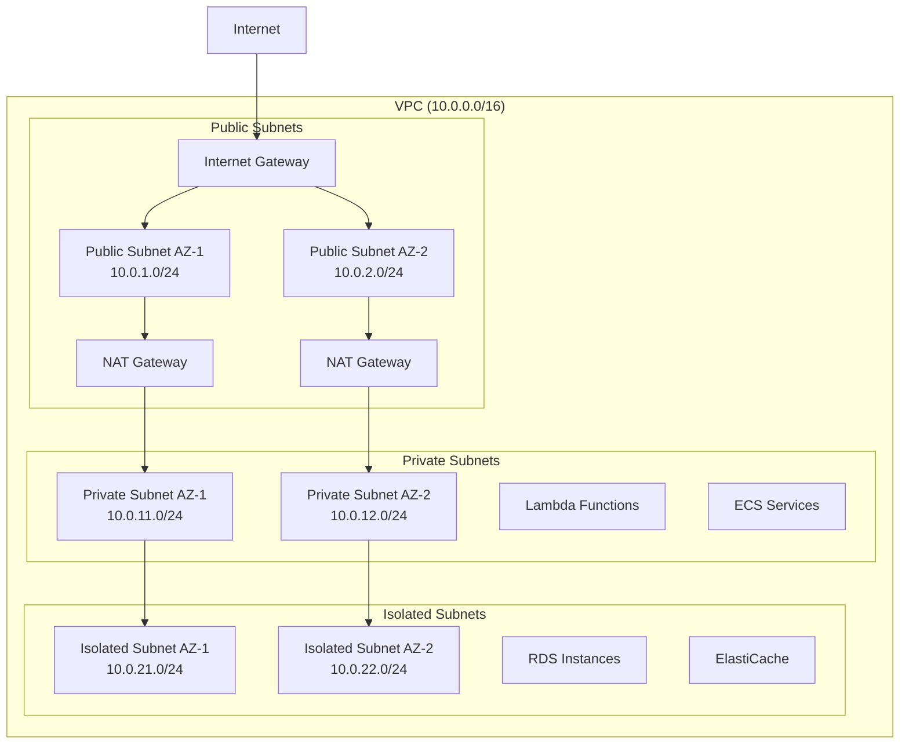
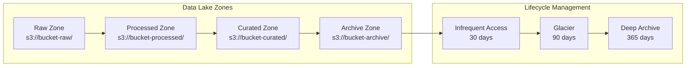

# Infrastructure Architecture

Detailed overview of the DevSecOps Platform infrastructure components, design patterns, and implementation details.

## Infrastructure Overview

The platform is built on AWS using Infrastructure as Code (IaC) with AWS CDK, implementing a multi-layered architecture that provides security, scalability, and operational excellence.

## Core Infrastructure Components

### 1. Network Layer

#### VPC Architecture



#### Network Security

- **Security Groups**: Stateful firewall rules at the instance level
- **Network ACLs**: Stateless firewall rules at the subnet level
- **VPC Flow Logs**: Network traffic monitoring and analysis
- **VPC Endpoints**: Private connectivity to AWS services

### 2. Compute Layer

#### Serverless Computing

```python
# Lambda Function Configuration
lambda_.Function(
    self,
    "DataProcessor",
    runtime=lambda_.Runtime.PYTHON_3_9,
    handler="index.handler",
    code=lambda_.Code.from_asset("src/lambda"),
    timeout=Duration.minutes(15),
    memory_size=1024,
    environment={
        "LOG_LEVEL": "INFO",
        "ENVIRONMENT": environment
    },
    vpc=vpc,
    vpc_subnets=ec2.SubnetSelection(
        subnet_type=ec2.SubnetType.PRIVATE_WITH_EGRESS
    ),
    security_groups=[lambda_security_group]
)
```

#### Container Services

```python
# ECS Fargate Service
ecs.FargateService(
    self,
    "PortalService",
    cluster=cluster,
    task_definition=task_definition,
    desired_count=2,
    assign_public_ip=False,
    vpc_subnets=ec2.SubnetSelection(
        subnet_type=ec2.SubnetType.PRIVATE_WITH_EGRESS
    ),
    security_groups=[ecs_security_group],
    enable_logging=True,
    health_check_grace_period=Duration.seconds(60)
)
```

### 3. Storage Layer

#### S3 Data Lake Architecture



#### Database Services

```python
# RDS PostgreSQL
rds.DatabaseInstance(
    self,
    "MetadataDB",
    engine=rds.DatabaseInstanceEngine.postgres(
        version=rds.PostgresEngineVersion.VER_13_7
    ),
    instance_type=ec2.InstanceType.of(
        ec2.InstanceClass.T3,
        ec2.InstanceSize.MICRO
    ),
    vpc=vpc,
    vpc_subnets=ec2.SubnetSelection(
        subnet_type=ec2.SubnetType.PRIVATE_ISOLATED
    ),
    security_groups=[rds_security_group],
    storage_encrypted=True,
    backup_retention=Duration.days(7),
    deletion_protection=True,
    multi_az=True
)
```

### 4. Data Processing Layer

#### AWS Glue Configuration

```python
# Glue Database
glue.CfnDatabase(
    self,
    "DataCatalog",
    catalog_id=Aws.ACCOUNT_ID,
    database_input=glue.CfnDatabase.DatabaseInputProperty(
        name=f"{project_name}_catalog",
        description="Data catalog for the platform"
    )
)

# Glue Crawler
glue.CfnCrawler(
    self,
    "DataCrawler",
    role=glue_role.role_arn,
    database_name=database.ref,
    targets=glue.CfnCrawler.TargetsProperty(
        s3_targets=[
            glue.CfnCrawler.S3TargetProperty(
                path=f"s3://{raw_bucket.bucket_name}/",
                exclusions=["**/_SUCCESS", "**/_metadata"]
            )
        ]
    ),
    schedule=glue.CfnCrawler.ScheduleProperty(
        schedule_expression="cron(0 2 * * ? *)"  # Daily at 2 AM
    )
)
```

#### Step Functions Orchestration

```python
# Step Functions State Machine
definition = {
    "Comment": "Data processing pipeline",
    "StartAt": "ValidateInput",
    "States": {
        "ValidateInput": {
            "Type": "Task",
            "Resource": validate_lambda.function_arn,
            "Next": "ProcessData"
        },
        "ProcessData": {
            "Type": "Task",
            "Resource": "arn:aws:states:::glue:startJobRun.sync",
            "Parameters": {
                "JobName": glue_job.ref
            },
            "Next": "QualityCheck"
        },
        "QualityCheck": {
            "Type": "Task",
            "Resource": quality_check_lambda.function_arn,
            "End": True
        }
    }
}

stepfunctions.StateMachine(
    self,
    "DataPipeline",
    definition=stepfunctions.DefinitionBody.from_string(
        json.dumps(definition)
    ),
    role=step_functions_role
)
```

## Security Infrastructure

### 1. Identity and Access Management

#### IAM Roles and Policies

```python
# Lambda Execution Role
lambda_role = iam.Role(
    self,
    "LambdaExecutionRole",
    assumed_by=iam.ServicePrincipal("lambda.amazonaws.com"),
    managed_policies=[
        iam.ManagedPolicy.from_aws_managed_policy_name(
            "service-role/AWSLambdaVPCAccessExecutionRole"
        )
    ],
    inline_policies={
        "S3Access": iam.PolicyDocument(
            statements=[
                iam.PolicyStatement(
                    effect=iam.Effect.ALLOW,
                    actions=[
                        "s3:GetObject",
                        "s3:PutObject",
                        "s3:DeleteObject"
                    ],
                    resources=[
                        f"{data_bucket.bucket_arn}/*"
                    ]
                )
            ]
        )
    }
)
```

### 2. Encryption and Key Management

#### KMS Key Configuration

```python
# Customer Managed KMS Key
kms_key = kms.Key(
    self,
    "DataEncryptionKey",
    description="Encryption key for platform data",
    enable_key_rotation=True,
    policy=iam.PolicyDocument(
        statements=[
            iam.PolicyStatement(
                effect=iam.Effect.ALLOW,
                principals=[iam.AccountRootPrincipal()],
                actions=["kms:*"],
                resources=["*"]
            ),
            iam.PolicyStatement(
                effect=iam.Effect.ALLOW,
                principals=[lambda_role],
                actions=[
                    "kms:Decrypt",
                    "kms:GenerateDataKey"
                ],
                resources=["*"]
            )
        ]
    )
)

# S3 Bucket with KMS Encryption
s3.Bucket(
    self,
    "EncryptedDataBucket",
    encryption=s3.BucketEncryption.KMS,
    encryption_key=kms_key,
    block_public_access=s3.BlockPublicAccess.BLOCK_ALL,
    versioning=True
)
```

### 3. Network Security

#### Security Groups

```python
# Lambda Security Group
lambda_sg = ec2.SecurityGroup(
    self,
    "LambdaSecurityGroup",
    vpc=vpc,
    description="Security group for Lambda functions",
    allow_all_outbound=False
)

# Allow HTTPS outbound
lambda_sg.add_egress_rule(
    ec2.Peer.any_ipv4(),
    ec2.Port.tcp(443),
    "HTTPS outbound"
)

# Allow database access
lambda_sg.add_egress_rule(
    rds_sg,
    ec2.Port.tcp(5432),
    "PostgreSQL access"
)

# RDS Security Group
rds_sg = ec2.SecurityGroup(
    self,
    "RDSSecurityGroup",
    vpc=vpc,
    description="Security group for RDS instances",
    allow_all_outbound=False
)

# Allow access from Lambda
rds_sg.add_ingress_rule(
    lambda_sg,
    ec2.Port.tcp(5432),
    "PostgreSQL from Lambda"
)
```

## Monitoring Infrastructure

### 1. CloudWatch Configuration

#### Custom Metrics and Alarms

```python
# Custom Metric
metric = cloudwatch.Metric(
    namespace="Platform/DataPipeline",
    metric_name="ProcessedRecords",
    dimensions_map={
        "Environment": environment,
        "Pipeline": pipeline_name
    }
)

# CloudWatch Alarm
cloudwatch.Alarm(
    self,
    "HighErrorRateAlarm",
    metric=cloudwatch.Metric(
        namespace="AWS/Lambda",
        metric_name="Errors",
        dimensions_map={
            "FunctionName": lambda_function.function_name
        }
    ),
    threshold=5,
    evaluation_periods=2,
    comparison_operator=cloudwatch.ComparisonOperator.GREATER_THAN_THRESHOLD,
    alarm_description="High error rate detected",
    alarm_actions=[sns_topic]
)
```

#### Log Groups and Retention

```python
# CloudWatch Log Group
logs.LogGroup(
    self,
    "ApplicationLogs",
    log_group_name=f"/aws/lambda/{function_name}",
    retention=logs.RetentionDays.ONE_MONTH,
    removal_policy=RemovalPolicy.DESTROY
)

# VPC Flow Logs
ec2.FlowLog(
    self,
    "VPCFlowLogs",
    resource_type=ec2.FlowLogResourceType.from_vpc(vpc),
    destination=ec2.FlowLogDestination.to_cloud_watch_logs(
        log_group=logs.LogGroup(
            self,
            "VPCFlowLogsGroup",
            retention=logs.RetentionDays.ONE_WEEK
        )
    )
)
```

### 2. Distributed Tracing

#### X-Ray Configuration

```python
# Enable X-Ray tracing for Lambda
lambda_.Function(
    self,
    "TracedFunction",
    runtime=lambda_.Runtime.PYTHON_3_9,
    handler="index.handler",
    code=lambda_.Code.from_asset("src"),
    tracing=lambda_.Tracing.ACTIVE,
    environment={
        "_X_AMZN_TRACE_ID": "Root=1-5e1b4151-5ac6c58dc39a6b6b1a4c8c5e"
    }
)

# X-Ray service map
xray.CfnSamplingRule(
    self,
    "SamplingRule",
    sampling_rule=xray.CfnSamplingRule.SamplingRuleProperty(
        rule_name="PlatformSampling",
        priority=9000,
        fixed_rate=0.1,
        reservoir_size=1,
        service_name="*",
        service_type="*",
        host="*",
        http_method="*",
        url_path="*",
        version=1
    )
)
```

## High Availability and Disaster Recovery

### 1. Multi-AZ Deployment

```python
# Multi-AZ RDS
rds.DatabaseInstance(
    self,
    "HADatabase",
    engine=rds.DatabaseInstanceEngine.postgres(),
    multi_az=True,
    backup_retention=Duration.days(7),
    preferred_backup_window="03:00-04:00",
    preferred_maintenance_window="sun:04:00-sun:05:00"
)

# Auto Scaling Group for ECS
autoscaling.AutoScalingGroup(
    self,
    "ECSAutoScaling",
    vpc=vpc,
    instance_type=ec2.InstanceType.of(
        ec2.InstanceClass.T3,
        ec2.InstanceSize.MEDIUM
    ),
    machine_image=ecs.EcsOptimizedImage.amazon_linux2(),
    min_capacity=2,
    max_capacity=10,
    desired_capacity=2,
    vpc_subnets=ec2.SubnetSelection(
        subnet_type=ec2.SubnetType.PRIVATE_WITH_EGRESS
    )
)
```

### 2. Backup and Recovery

```python
# AWS Backup
backup_vault = backup.BackupVault(
    self,
    "PlatformBackupVault",
    backup_vault_name="platform-backup-vault",
    encryption_key=kms_key
)

backup_plan = backup.BackupPlan(
    self,
    "PlatformBackupPlan",
    backup_plan_name="platform-backup-plan"
)

backup_plan.add_rule(
    backup.BackupPlanRule(
        backup_vault=backup_vault,
        rule_name="DailyBackup",
        schedule_expression=events.Schedule.cron(
            hour="2",
            minute="0"
        ),
        delete_after=Duration.days(30),
        move_to_cold_storage_after=Duration.days(7)
    )
)

backup_plan.add_selection(
    "BackupSelection",
    resources=[
        backup.BackupResource.from_rds_database(database),
        backup.BackupResource.from_dynamodb_table(table)
    ]
)
```

## Performance Optimization

### 1. Caching Layer

```python
# ElastiCache Redis Cluster
elasticache.CfnCacheCluster(
    self,
    "RedisCache",
    cache_node_type="cache.t3.micro",
    engine="redis",
    num_cache_nodes=1,
    vpc_security_group_ids=[cache_security_group.security_group_id],
    cache_subnet_group_name=cache_subnet_group.ref
)

# CloudFront Distribution
cloudfront.Distribution(
    self,
    "CDN",
    default_behavior=cloudfront.BehaviorOptions(
        origin=origins.S3Origin(static_assets_bucket),
        viewer_protocol_policy=cloudfront.ViewerProtocolPolicy.REDIRECT_TO_HTTPS,
        cache_policy=cloudfront.CachePolicy.CACHING_OPTIMIZED,
        compress=True
    ),
    additional_behaviors={
        "/api/*": cloudfront.BehaviorOptions(
            origin=origins.LoadBalancerV2Origin(load_balancer),
            cache_policy=cloudfront.CachePolicy.CACHING_DISABLED,
            origin_request_policy=cloudfront.OriginRequestPolicy.ALL_VIEWER
        )
    }
)
```

### 2. Auto Scaling

```python
# Lambda Concurrency
lambda_.Function(
    self,
    "ScalableFunction",
    reserved_concurrent_executions=100,
    runtime=lambda_.Runtime.PYTHON_3_9,
    handler="index.handler",
    code=lambda_.Code.from_asset("src")
)

# ECS Service Auto Scaling
scalable_target = ecs_service.auto_scale_task_count(
    min_capacity=2,
    max_capacity=20
)

scalable_target.scale_on_cpu_utilization(
    "CpuScaling",
    target_utilization_percent=70,
    scale_in_cooldown=Duration.seconds(300),
    scale_out_cooldown=Duration.seconds(60)
)

scalable_target.scale_on_memory_utilization(
    "MemoryScaling",
    target_utilization_percent=80
)
```

## Cost Optimization

### 1. Resource Optimization

```python
# Spot Instances for Development
autoscaling.AutoScalingGroup(
    self,
    "DevAutoScaling",
    vpc=vpc,
    instance_type=ec2.InstanceType.of(
        ec2.InstanceClass.T3,
        ec2.InstanceSize.MICRO
    ),
    spot_price="0.01",  # Use spot instances for cost savings
    min_capacity=0,
    max_capacity=5,
    desired_capacity=1 if environment == "dev" else 2
)

# S3 Lifecycle Policies
s3.Bucket(
    self,
    "CostOptimizedBucket",
    lifecycle_rules=[
        s3.LifecycleRule(
            transitions=[
                s3.Transition(
                    storage_class=s3.StorageClass.INFREQUENT_ACCESS,
                    transition_after=Duration.days(30)
                ),
                s3.Transition(
                    storage_class=s3.StorageClass.GLACIER,
                    transition_after=Duration.days(90)
                ),
                s3.Transition(
                    storage_class=s3.StorageClass.DEEP_ARCHIVE,
                    transition_after=Duration.days(365)
                )
            ],
            expiration=Duration.days(2555)  # 7 years
        )
    ]
)
```

### 2. Cost Monitoring

```python
# Cost Anomaly Detection
budgets.CfnBudget(
    self,
    "CostBudget",
    budget=budgets.CfnBudget.BudgetDataProperty(
        budget_name="platform-monthly-budget",
        budget_limit=budgets.CfnBudget.SpendProperty(
            amount=100,
            unit="USD"
        ),
        time_unit="MONTHLY",
        budget_type="COST"
    ),
    notifications_with_subscribers=[
        budgets.CfnBudget.NotificationWithSubscribersProperty(
            notification=budgets.CfnBudget.NotificationProperty(
                notification_type="ACTUAL",
                comparison_operator="GREATER_THAN",
                threshold=80
            ),
            subscribers=[
                budgets.CfnBudget.SubscriberProperty(
                    subscription_type="EMAIL",
                    address="platform-team@company.com"
                )
            ]
        )
    ]
)
```

## Infrastructure Testing

### 1. CDK Unit Tests

```python
# Test infrastructure components
def test_vpc_creation():
    app = App()
    stack = CoreInfrastructureStack(app, "TestStack")
    template = Template.from_stack(stack)
    
    template.has_resource_properties("AWS::EC2::VPC", {
        "CidrBlock": "10.0.0.0/16",
        "EnableDnsHostnames": True,
        "EnableDnsSupport": True
    })

def test_s3_bucket_encryption():
    app = App()
    stack = DataPipelineStack(app, "TestStack")
    template = Template.from_stack(stack)
    
    template.has_resource_properties("AWS::S3::Bucket", {
        "BucketEncryption": {
            "ServerSideEncryptionConfiguration": [
                {
                    "ServerSideEncryptionByDefault": {
                        "SSEAlgorithm": "AES256"
                    }
                }
            ]
        }
    })
```

### 2. Integration Tests

```python
# Test deployed infrastructure
def test_lambda_function_execution():
    lambda_client = boto3.client('lambda')
    
    response = lambda_client.invoke(
        FunctionName='data-processor-dev',
        Payload=json.dumps({'test': 'data'})
    )
    
    assert response['StatusCode'] == 200
    
def test_s3_bucket_access():
    s3_client = boto3.client('s3')
    
    # Test bucket exists and is accessible
    response = s3_client.head_bucket(
        Bucket='platform-data-dev-123456789012'
    )
    
    assert response['ResponseMetadata']['HTTPStatusCode'] == 200
```

## Best Practices

### 1. Infrastructure as Code

- **Version Control**: All infrastructure code in Git
- **Modular Design**: Reusable constructs and stacks
- **Environment Separation**: Separate stacks per environment
- **Automated Testing**: Unit and integration tests for infrastructure

### 2. Security

- **Least Privilege**: Minimal required permissions
- **Encryption**: Encrypt all data at rest and in transit
- **Network Isolation**: Use VPCs and security groups
- **Regular Updates**: Keep all components updated

### 3. Monitoring

- **Comprehensive Logging**: Log all important events
- **Metrics Collection**: Collect business and technical metrics
- **Alerting**: Set up proactive alerting
- **Dashboards**: Create operational dashboards

### 4. Cost Management

- **Right Sizing**: Use appropriate instance sizes
- **Auto Scaling**: Scale based on demand
- **Lifecycle Policies**: Implement data lifecycle management
- **Regular Reviews**: Review and optimize costs regularly

For more detailed information, see:
- [Security Architecture](security.md)
- [Monitoring Architecture](monitoring.md)
- [Deployment Guide](../operations/deployment.md)
- [Cost Optimization](../operations/cost-optimization.md)
