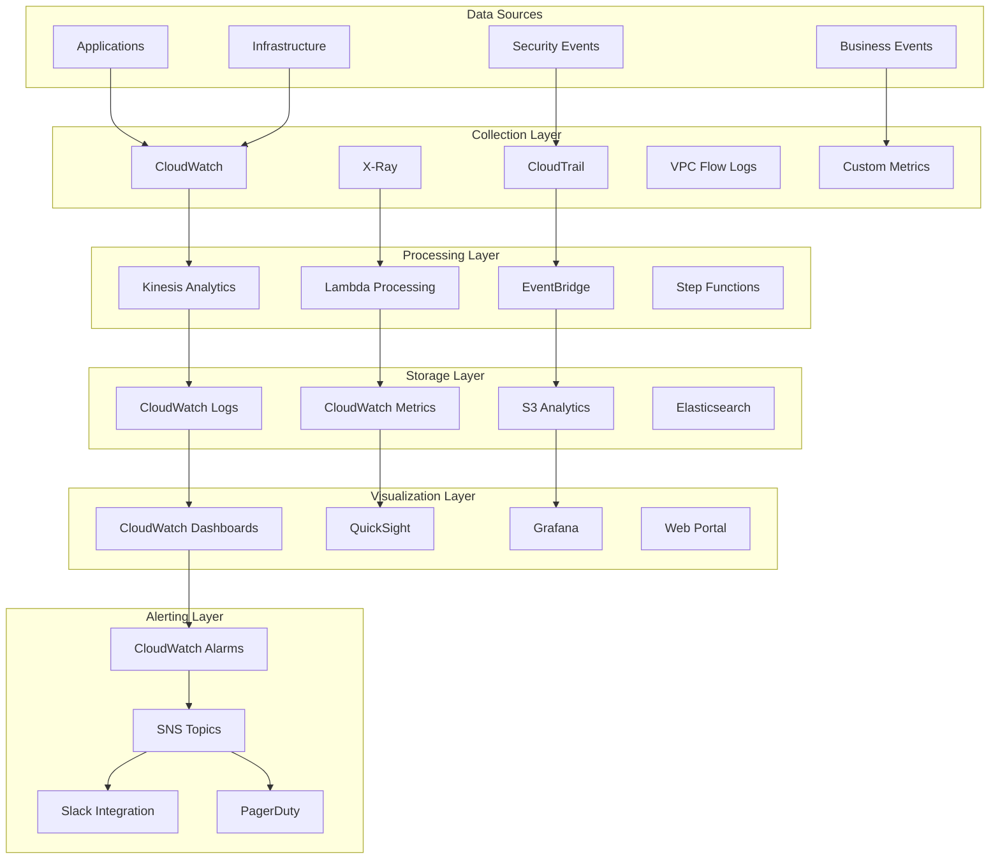

# Monitoring Architecture

Comprehensive monitoring and observability architecture for the DevSecOps Platform, implementing the three pillars of observability: metrics, logs, and traces.

## Monitoring Overview

The platform implements a comprehensive monitoring strategy that provides:

- **Real-time Visibility**: Into system health and performance
- **Proactive Alerting**: Early detection of issues and anomalies
- **Root Cause Analysis**: Detailed diagnostics and troubleshooting
- **Business Intelligence**: Insights into business metrics and KPIs
- **Compliance Monitoring**: Continuous compliance validation



## Three Pillars of Observability

### 1. Metrics

#### Infrastructure Metrics

```python
# Core infrastructure metrics
infrastructure_metrics = [
    # Compute metrics
    cloudwatch.Metric(
        namespace="AWS/Lambda",
        metric_name="Duration",
        dimensions_map={"FunctionName": function_name}
    ),
    cloudwatch.Metric(
        namespace="AWS/Lambda",
        metric_name="Errors",
        dimensions_map={"FunctionName": function_name}
    ),
    cloudwatch.Metric(
        namespace="AWS/Lambda",
        metric_name="Throttles",
        dimensions_map={"FunctionName": function_name}
    ),

    # Storage metrics
    cloudwatch.Metric(
        namespace="AWS/S3",
        metric_name="BucketSizeBytes",
        dimensions_map={"BucketName": bucket_name, "StorageType": "StandardStorage"}
    ),
    cloudwatch.Metric(
        namespace="AWS/S3",
        metric_name="NumberOfObjects",
        dimensions_map={"BucketName": bucket_name, "StorageType": "AllStorageTypes"}
    ),

    # Database metrics
    cloudwatch.Metric(
        namespace="AWS/RDS",
        metric_name="CPUUtilization",
        dimensions_map={"DBInstanceIdentifier": db_instance_id}
    ),
    cloudwatch.Metric(
        namespace="AWS/RDS",
        metric_name="DatabaseConnections",
        dimensions_map={"DBInstanceIdentifier": db_instance_id}
    )
]
```

#### Application Metrics

```python
# Custom application metrics
class MetricsCollector:
    def __init__(self):
        self.cloudwatch = boto3.client('cloudwatch')
        self.namespace = "Application/DataPipeline"

    def put_metric(self, metric_name: str, value: float, unit: str = "Count", dimensions: Dict[str, str] = None):
        """Put custom metric to CloudWatch."""
        metric_data = {
            'MetricName': metric_name,
            'Value': value,
            'Unit': unit,
            'Timestamp': datetime.utcnow()
        }

        if dimensions:
            metric_data['Dimensions'] = [
                {'Name': k, 'Value': v} for k, v in dimensions.items()
            ]

        self.cloudwatch.put_metric_data(
            Namespace=self.namespace,
            MetricData=[metric_data]
        )

    def record_processing_time(self, pipeline_name: str, duration: float):
        """Record pipeline processing time."""
        self.put_metric(
            "ProcessingDuration",
            duration,
            "Seconds",
            {"Pipeline": pipeline_name}
        )

    def record_data_quality_score(self, pipeline_name: str, score: float):
        """Record data quality score."""
        self.put_metric(
            "DataQualityScore",
            score,
            "Percent",
            {"Pipeline": pipeline_name}
        )

    def record_business_metric(self, metric_name: str, value: float, business_unit: str):
        """Record business metric."""
        self.put_metric(
            metric_name,
            value,
            "Count",
            {"BusinessUnit": business_unit}
        )

# Usage in Lambda function
metrics = MetricsCollector()

def lambda_handler(event, context):
    start_time = time.time()

    try:
        # Process data
        result = process_data(event)

        # Record success metrics
        metrics.record_processing_time(
            "sales-pipeline",
            time.time() - start_time
        )
        metrics.put_metric("ProcessedRecords", len(result), "Count")

        return result

    except Exception as e:
        # Record error metrics
        metrics.put_metric("ProcessingErrors", 1, "Count")
        raise
```

#### Business Metrics

```python
# Business KPI tracking
business_metrics = [
    "RevenuePerHour",
    "CustomerAcquisitionRate",
    "DataProcessingCost",
    "TimeToInsight",
    "DataFreshness",
    "PipelineEfficiency",
    "CostPerRecord",
    "BusinessValueGenerated"
]

class BusinessMetricsTracker:
    def __init__(self):
        self.metrics = MetricsCollector()

    def track_revenue_impact(self, pipeline_name: str, revenue_impact: float):
        """Track revenue impact of data pipeline."""
        self.metrics.put_metric(
            "RevenueImpact",
            revenue_impact,
            "None",
            {"Pipeline": pipeline_name}
        )

    def track_cost_efficiency(self, pipeline_name: str, records_processed: int, cost: float):
        """Track cost efficiency metrics."""
        cost_per_record = cost / records_processed if records_processed > 0 else 0

        self.metrics.put_metric(
            "CostPerRecord",
            cost_per_record,
            "None",
            {"Pipeline": pipeline_name}
        )

        self.metrics.put_metric(
            "ProcessingCost",
            cost,
            "None",
            {"Pipeline": pipeline_name}
        )
```

### 2. Logs

#### Structured Logging

```python
# Structured logging configuration
import json
import logging
from datetime import datetime
from typing import Dict, Any

class StructuredLogger:
    def __init__(self, name: str, level: str = "INFO"):
        self.logger = logging.getLogger(name)
        self.logger.setLevel(getattr(logging, level))

        # Configure JSON formatter
        handler = logging.StreamHandler()
        handler.setFormatter(self._get_json_formatter())
        self.logger.addHandler(handler)

    def _get_json_formatter(self):
        """Get JSON formatter for structured logging."""
        class JsonFormatter(logging.Formatter):
            def format(self, record):
                log_entry = {
                    "timestamp": datetime.utcnow().isoformat(),
                    "level": record.levelname,
                    "logger": record.name,
                    "message": record.getMessage(),
                    "module": record.module,
                    "function": record.funcName,
                    "line": record.lineno
                }

                # Add extra fields if present
                if hasattr(record, 'extra_fields'):
                    log_entry.update(record.extra_fields)

                return json.dumps(log_entry)

        return JsonFormatter()

    def info(self, message: str, **kwargs):
        """Log info message with structured data."""
        extra = {'extra_fields': kwargs} if kwargs else {}
        self.logger.info(message, extra=extra)

    def error(self, message: str, error: Exception = None, **kwargs):
        """Log error message with structured data."""
        extra_fields = kwargs.copy()
        if error:
            extra_fields.update({
                'error_type': type(error).__name__,
                'error_message': str(error),
                'traceback': traceback.format_exc()
            })

        extra = {'extra_fields': extra_fields} if extra_fields else {}
        self.logger.error(message, extra=extra)

    def warning(self, message: str, **kwargs):
        """Log warning message with structured data."""
        extra = {'extra_fields': kwargs} if kwargs else {}
        self.logger.warning(message, extra=extra)

# Usage example
logger = StructuredLogger("data-pipeline")

def process_batch(batch_id: str, records: List[Dict]):
    logger.info(
        "Starting batch processing",
        batch_id=batch_id,
        record_count=len(records),
        pipeline="sales-analytics"
    )

    try:
        # Process records
        processed_count = 0
        for record in records:
            process_record(record)
            processed_count += 1

        logger.info(
            "Batch processing completed",
            batch_id=batch_id,
            processed_count=processed_count,
            success_rate=processed_count / len(records)
        )

    except Exception as e:
        logger.error(
            "Batch processing failed",
            error=e,
            batch_id=batch_id,
            processed_count=processed_count
        )
        raise
```

#### Log Aggregation and Analysis

```python
# CloudWatch Logs configuration
log_group = logs.LogGroup(
    self,
    "ApplicationLogGroup",
    log_group_name=f"/aws/lambda/{function_name}",
    retention=logs.RetentionDays.ONE_MONTH,
    removal_policy=RemovalPolicy.DESTROY
)

# Log insights queries for analysis
log_insights_queries = [
    {
        "name": "Error Analysis",
        "query": """
            fields @timestamp, level, message, error_type, error_message
            | filter level = "ERROR"
            | stats count() by error_type
            | sort count desc
        """
    },
    {
        "name": "Performance Analysis",
        "query": """
            fields @timestamp, message, duration, pipeline
            | filter message like /processing completed/
            | stats avg(duration), max(duration), min(duration) by pipeline
        """
    },
    {
        "name": "Business Metrics",
        "query": """
            fields @timestamp, message, record_count, success_rate, pipeline
            | filter message like /batch processing completed/
            | stats sum(record_count), avg(success_rate) by pipeline
        """
    }
]

# Automated log analysis Lambda
log_analyzer = lambda_.Function(
    self,
    "LogAnalyzer",
    runtime=lambda_.Runtime.PYTHON_3_9,
    handler="log_analyzer.handler",
    code=lambda_.Code.from_asset("src/monitoring"),
    environment={
        "LOG_GROUP_NAME": log_group.log_group_name
    },
    timeout=Duration.minutes(5)
)

# Schedule log analysis
eventbridge.Rule(
    self,
    "LogAnalysisSchedule",
    schedule=eventbridge.Schedule.rate(Duration.hours(1)),
    targets=[targets.LambdaFunction(log_analyzer)]
)
```

### 3. Distributed Tracing

#### X-Ray Configuration

```python
# Enable X-Ray tracing for Lambda functions
traced_function = lambda_.Function(
    self,
    "TracedFunction",
    runtime=lambda_.Runtime.PYTHON_3_9,
    handler="traced_handler.handler",
    code=lambda_.Code.from_asset("src/traced"),
    tracing=lambda_.Tracing.ACTIVE,
    environment={
        "_X_AMZN_TRACE_ID": "Root=1-5e1b4151-5ac6c58dc39a6b6b1a4c8c5e"
    }
)

# X-Ray sampling rules
xray.CfnSamplingRule(
    self,
    "TracingSamplingRule",
    sampling_rule=xray.CfnSamplingRule.SamplingRuleProperty(
        rule_name="DataPipelineTracing",
        priority=9000,
        fixed_rate=0.1,  # 10% sampling rate
        reservoir_size=1,
        service_name="data-pipeline",
        service_type="*",
        host="*",
        http_method="*",
        url_path="*",
        version=1
    )
)
```

#### Custom Tracing

```python
# Custom tracing implementation
from aws_xray_sdk.core import xray_recorder
from aws_xray_sdk.core import patch_all
import boto3

# Patch AWS SDK calls
patch_all()

class TracingHelper:
    @staticmethod
    def trace_function(name: str):
        """Decorator for tracing functions."""
        def decorator(func):
            def wrapper(*args, **kwargs):
                with xray_recorder.in_subsegment(name):
                    # Add metadata
                    xray_recorder.current_subsegment().put_metadata(
                        'function_args', {
                            'args_count': len(args),
                            'kwargs_keys': list(kwargs.keys())
                        }
                    )

                    try:
                        result = func(*args, **kwargs)

                        # Add success annotation
                        xray_recorder.current_subsegment().put_annotation(
                            'status', 'success'
                        )

                        return result

                    except Exception as e:
                        # Add error annotation
                        xray_recorder.current_subsegment().put_annotation(
                            'status', 'error'
                        )
                        xray_recorder.current_subsegment().put_annotation(
                            'error_type', type(e).__name__
                        )
                        raise

            return wrapper
        return decorator

    @staticmethod
    def add_custom_segment(name: str, metadata: Dict[str, Any]):
        """Add custom segment with metadata."""
        with xray_recorder.in_subsegment(name):
            for key, value in metadata.items():
                xray_recorder.current_subsegment().put_metadata(key, value)

# Usage example
@TracingHelper.trace_function("data_processing")
def process_data(data: List[Dict]) -> Dict[str, Any]:
    """Process data with tracing."""

    # Add custom segment for data validation
    TracingHelper.add_custom_segment(
        "data_validation",
        {
            "record_count": len(data),
            "validation_rules": ["completeness", "format", "business_rules"]
        }
    )

    # Process data
    processed_data = []
    for record in data:
        processed_record = transform_record(record)
        processed_data.append(processed_record)

    return {
        "processed_count": len(processed_data),
        "success": True
    }
```

## Dashboards and Visualization

### 1. CloudWatch Dashboards

```python
# Comprehensive monitoring dashboard
monitoring_dashboard = cloudwatch.Dashboard(
    self,
    "PlatformMonitoringDashboard",
    dashboard_name=f"{project_name}-monitoring"
)

# Infrastructure health widgets
monitoring_dashboard.add_widgets(
    cloudwatch.GraphWidget(
        title="Lambda Function Performance",
        left=[
            cloudwatch.Metric(
                namespace="AWS/Lambda",
                metric_name="Duration",
                dimensions_map={"FunctionName": function_name},
                statistic="Average"
            )
        ],
        right=[
            cloudwatch.Metric(
                namespace="AWS/Lambda",
                metric_name="Errors",
                dimensions_map={"FunctionName": function_name},
                statistic="Sum"
            )
        ],
        width=12,
        height=6
    ),

    cloudwatch.GraphWidget(
        title="Data Pipeline Metrics",
        left=[
            cloudwatch.Metric(
                namespace="Application/DataPipeline",
                metric_name="ProcessedRecords",
                statistic="Sum"
            )
        ],
        right=[
            cloudwatch.Metric(
                namespace="Application/DataPipeline",
                metric_name="DataQualityScore",
                statistic="Average"
            )
        ],
        width=12,
        height=6
    ),

    cloudwatch.SingleValueWidget(
        title="System Health Score",
        metrics=[
            cloudwatch.Metric(
                namespace="Platform/Health",
                metric_name="OverallHealthScore",
                statistic="Average"
            )
        ],
        width=6,
        height=6
    ),

    cloudwatch.LogQueryWidget(
        title="Recent Errors",
        log_groups=[log_group],
        query_lines=[
            "fields @timestamp, level, message, error_type",
            "filter level = 'ERROR'",
            "sort @timestamp desc",
            "limit 20"
        ],
        width=18,
        height=6
    )
)
```

### 2. Business Intelligence Dashboard

```python
# Business metrics dashboard
business_dashboard = cloudwatch.Dashboard(
    self,
    "BusinessMetricsDashboard",
    dashboard_name=f"{project_name}-business"
)

business_dashboard.add_widgets(
    cloudwatch.GraphWidget(
        title="Revenue Impact",
        left=[
            cloudwatch.Metric(
                namespace="Business/Revenue",
                metric_name="RevenueImpact",
                statistic="Sum"
            )
        ],
        width=12,
        height=6
    ),

    cloudwatch.GraphWidget(
        title="Cost Efficiency",
        left=[
            cloudwatch.Metric(
                namespace="Business/Cost",
                metric_name="CostPerRecord",
                statistic="Average"
            )
        ],
        right=[
            cloudwatch.Metric(
                namespace="Business/Cost",
                metric_name="TotalProcessingCost",
                statistic="Sum"
            )
        ],
        width=12,
        height=6
    ),

    cloudwatch.GraphWidget(
        title="Data Freshness",
        left=[
            cloudwatch.Metric(
                namespace="Business/Quality",
                metric_name="DataFreshness",
                statistic="Average"
            )
        ],
        width=12,
        height=6
    )
)
```

## Alerting and Notification

### 1. Multi-Tier Alerting

```python
# Alert severity levels
class AlertSeverity:
    CRITICAL = "critical"
    WARNING = "warning"
    INFO = "info"

# Notification topics for different severity levels
critical_topic = sns.Topic(
    self,
    "CriticalAlerts",
    topic_name=f"{project_name}-critical-alerts"
)

warning_topic = sns.Topic(
    self,
    "WarningAlerts",
    topic_name=f"{project_name}-warning-alerts"
)

info_topic = sns.Topic(
    self,
    "InfoAlerts",
    topic_name=f"{project_name}-info-alerts"
)

# Email subscriptions
critical_topic.add_subscription(
    sns_subscriptions.EmailSubscription("oncall@company.com")
)

warning_topic.add_subscription(
    sns_subscriptions.EmailSubscription("platform-team@company.com")
)

# Slack integration
slack_integration = lambda_.Function(
    self,
    "SlackIntegration",
    runtime=lambda_.Runtime.PYTHON_3_9,
    handler="slack_handler.handler",
    code=lambda_.Code.from_asset("src/notifications"),
    environment={
        "SLACK_WEBHOOK_URL": slack_webhook_url
    }
)

critical_topic.add_subscription(
    sns_subscriptions.LambdaSubscription(slack_integration)
)
```

### 2. Intelligent Alerting

```python
# Smart alerting with anomaly detection
class SmartAlerting:
    def __init__(self):
        self.cloudwatch = boto3.client('cloudwatch')

    def create_anomaly_alarm(self, metric_name: str, namespace: str, threshold_factor: float = 2.0):
        """Create anomaly detection alarm."""

        # Create anomaly detector
        self.cloudwatch.put_anomaly_detector(
            Namespace=namespace,
            MetricName=metric_name,
            Stat='Average'
        )

        # Create alarm based on anomaly detection
        alarm_name = f"{metric_name}-anomaly-alarm"

        self.cloudwatch.put_metric_alarm(
            AlarmName=alarm_name,
            ComparisonOperator='LessThanLowerOrGreaterThanUpperThreshold',
            EvaluationPeriods=2,
            Metrics=[
                {
                    'Id': 'm1',
                    'MetricStat': {
                        'Metric': {
                            'Namespace': namespace,
                            'MetricName': metric_name
                        },
                        'Period': 300,
                        'Stat': 'Average'
                    }
                },
                {
                    'Id': 'ad1',
                    'Expression': f'ANOMALY_DETECTION_FUNCTION(m1, {threshold_factor})'
                }
            ],
            ThresholdMetricId='ad1',
            ActionsEnabled=True,
            AlarmActions=[critical_topic.topic_arn],
            AlarmDescription=f'Anomaly detection for {metric_name}'
        )

    def create_composite_alarm(self, alarm_name: str, alarm_rule: str):
        """Create composite alarm based on multiple conditions."""
        self.cloudwatch.put_composite_alarm(
            AlarmName=alarm_name,
            AlarmRule=alarm_rule,
            ActionsEnabled=True,
            AlarmActions=[critical_topic.topic_arn],
            AlarmDescription="Composite alarm for system health"
        )

# Usage
smart_alerting = SmartAlerting()

# Create anomaly detection for key metrics
smart_alerting.create_anomaly_alarm(
    "ProcessedRecords",
    "Application/DataPipeline"
)

# Create composite alarm for system health
smart_alerting.create_composite_alarm(
    "SystemHealthAlarm",
    "ALARM('HighErrorRate') OR ALARM('HighLatency') OR ALARM('LowDataQuality')"
)
```

### 3. Alert Escalation

```python
# Alert escalation workflow
escalation_workflow = stepfunctions.StateMachine(
    self,
    "AlertEscalationWorkflow",
    definition=stepfunctions.DefinitionBody.from_string(json.dumps({
        "Comment": "Alert escalation workflow",
        "StartAt": "InitialNotification",
        "States": {
            "InitialNotification": {
                "Type": "Task",
                "Resource": "arn:aws:states:::sns:publish",
                "Parameters": {
                    "TopicArn": warning_topic.topic_arn,
                    "Message.$": "$.alertMessage"
                },
                "Next": "WaitForAcknowledgment"
            },
            "WaitForAcknowledgment": {
                "Type": "Wait",
                "Seconds": 300,  # 5 minutes
                "Next": "CheckAcknowledgment"
            },
            "CheckAcknowledgment": {
                "Type": "Task",
                "Resource": check_ack_lambda.function_arn,
                "Next": "EscalationDecision"
            },
            "EscalationDecision": {
                "Type": "Choice",
                "Choices": [
                    {
                        "Variable": "$.acknowledged",
                        "BooleanEquals": True,
                        "Next": "AlertResolved"
                    }
                ],
                "Default": "EscalateAlert"
            },
            "EscalateAlert": {
                "Type": "Task",
                "Resource": "arn:aws:states:::sns:publish",
                "Parameters": {
                    "TopicArn": critical_topic.topic_arn,
                    "Message.$": "$.escalatedMessage"
                },
                "End": True
            },
            "AlertResolved": {
                "Type": "Pass",
                "End": True
            }
        }
    })),
    role=step_functions_role
)
```

For more detailed information, see:
- [Architecture Overview](overview.md)
- [Infrastructure Architecture](infrastructure.md)
- [Operations Guide](../operations/monitoring.md)
- [Troubleshooting Guide](../operations/troubleshooting.md)