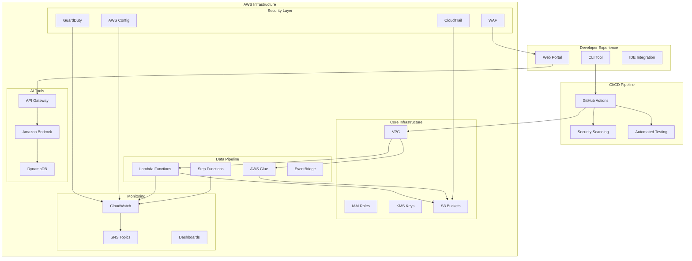
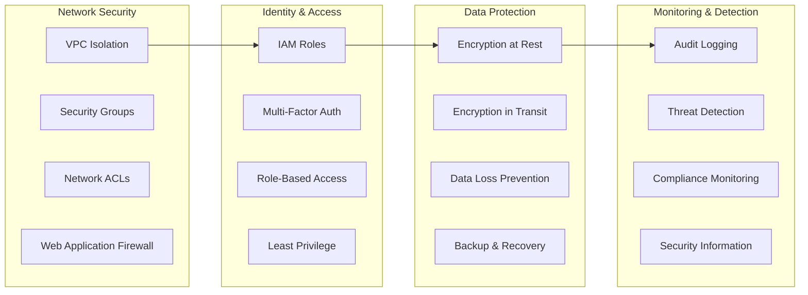
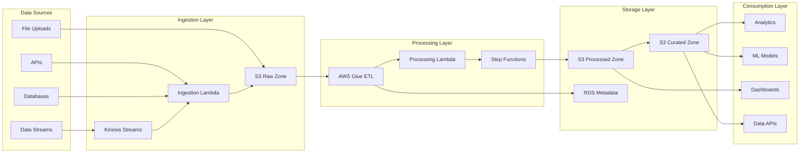
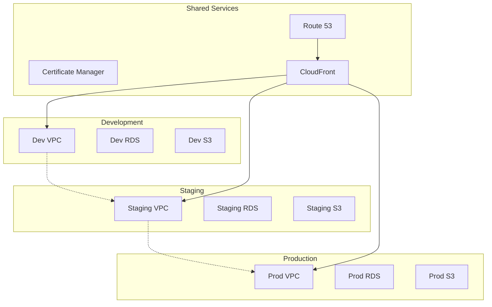
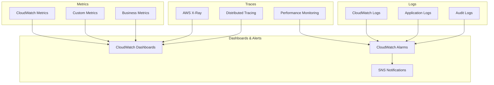

# Architecture Overview

The DevSecOps Platform for Data & AI Organization is built on AWS using a microservices architecture with security-by-design principles and comprehensive observability.

## High-Level Architecture

## Core Components

### 1. Infrastructure Stacks

The platform is organized into six main CDK stacks:

#### Core Infrastructure Stack
- **VPC**: Multi-AZ VPC with public, private, and isolated subnets
- **S3 Buckets**: Data lake, artifacts, and logs storage
- **KMS Keys**: Encryption keys for data protection
- **IAM Roles**: Least-privilege access control
- **VPC Endpoints**: Secure access to AWS services

#### Security Stack
- **Security Groups**: Network-level access control
- **WAF**: Web Application Firewall with managed rules
- **GuardDuty**: Threat detection and monitoring
- **AWS Config**: Configuration compliance monitoring
- **CloudTrail**: API audit logging

#### Data Pipeline Stack
- **Lambda Functions**: Serverless data processing
- **AWS Glue**: Data cataloging and ETL jobs
- **Step Functions**: Workflow orchestration
- **EventBridge**: Event-driven processing
- **RDS**: Metadata and configuration storage

#### Monitoring Stack
- **CloudWatch**: Metrics, logs, and dashboards
- **SNS Topics**: Alerting and notifications
- **Custom Metrics**: Application-specific monitoring
- **Cost Optimization**: Usage and cost tracking

#### Portal Stack
- **CloudFront**: Global content delivery
- **S3**: Static website hosting
- **API Gateway**: RESTful APIs
- **ECS**: Containerized backend services
- **ALB**: Load balancing and health checks

#### AI Tools Stack
- **Amazon Bedrock**: AI-powered code generation
- **DynamoDB**: Template and session storage
- **API Gateway**: RESTful API for AI services
- **Lambda Functions**: AI processing logic

### 2. Security Architecture

#### Defense in Depth

#### Security Controls

1. **Network Security**:
   - VPC with private subnets for sensitive workloads
   - Security groups with minimal required access
   - WAF protection for web applications
   - VPC Flow Logs for network monitoring

2. **Identity and Access Management**:
   - IAM roles with least-privilege principles
   - Cross-account role assumptions for multi-environment access
   - Service-linked roles for AWS services
   - Regular access reviews and rotation

3. **Data Protection**:
   - KMS encryption for all data at rest
   - TLS 1.2+ for all data in transit
   - S3 bucket policies with encryption requirements
   - Backup and disaster recovery procedures

4. **Monitoring and Detection**:
   - CloudTrail for all API calls
   - GuardDuty for threat detection
   - AWS Config for compliance monitoring
   - Custom security metrics and alerting

### 3. Data Architecture

#### Data Flow

#### Data Zones

1. **Raw Zone**: Unprocessed data as received from sources
2. **Processed Zone**: Cleaned and validated data
3. **Curated Zone**: Business-ready, aggregated data
4. **Archive Zone**: Long-term storage for compliance

### 4. Deployment Architecture

#### Multi-Environment Strategy

#### Environment Characteristics

| Environment | Purpose | Characteristics | Approval Required |
|-------------|---------|-----------------|-------------------|
| **Development** | Rapid iteration and testing | - Minimal resources - Auto-scaling disabled - Short retention periods | No |
| **Staging** | Production-like validation | - Production-like sizing - Full monitoring - Extended retention | Manual |
| **Production** | Live workloads | - High availability - Disaster recovery - Full compliance | Manual + Security Review |

### 5. Observability Architecture

#### Three Pillars of Observability

#### Monitoring Strategy

1. **Infrastructure Monitoring**:
   - AWS service metrics (Lambda, Glue, RDS, etc.)
   - Custom application metrics
   - Cost and usage monitoring

2. **Application Monitoring**:
   - Business KPIs and SLAs
   - Error rates and latency
   - User experience metrics

3. **Security Monitoring**:
   - Security events and incidents
   - Compliance violations
   - Threat detection alerts

4. **Operational Monitoring**:
   - Deployment success/failure
   - Pipeline execution status
   - Resource utilization

## Design Principles

### 1. Security by Design

- **Zero Trust**: Never trust, always verify
- **Least Privilege**: Minimal required permissions
- **Defense in Depth**: Multiple layers of security
- **Encryption Everywhere**: Data protection at all levels

### 2. Well-Architected Framework

- **Operational Excellence**: Automated operations and monitoring
- **Security**: Comprehensive security controls
- **Reliability**: High availability and disaster recovery
- **Performance Efficiency**: Optimized resource usage
- **Cost Optimization**: Cost-effective resource management
- **Sustainability**: Environmentally responsible practices

### 3. DevSecOps Principles

- **Shift Left**: Security integrated early in development
- **Automation**: Automated testing and deployment
- **Continuous Monitoring**: Real-time security and compliance
- **Rapid Recovery**: Fast incident response and recovery

### 4. Data Governance

- **Data Quality**: Automated data validation and quality checks
- **Data Lineage**: Track data flow and transformations
- **Data Catalog**: Centralized metadata management
- **Privacy by Design**: Built-in privacy protection

## Scalability and Performance

### Horizontal Scaling

- **Lambda**: Automatic scaling based on demand
- **Glue**: Dynamic resource allocation
- **ECS**: Auto-scaling groups for containerized services
- **RDS**: Read replicas for read-heavy workloads

### Performance Optimization

- **Caching**: CloudFront and ElastiCache for improved performance
- **Compression**: Data compression for storage and transfer
- **Partitioning**: Data partitioning for faster queries
- **Indexing**: Optimized database indexing strategies

## Disaster Recovery

### Backup Strategy

- **RTO**: Recovery Time Objective < 4 hours
- **RPO**: Recovery Point Objective < 1 hour
- **Multi-AZ**: High availability across availability zones
- **Cross-Region**: Disaster recovery in secondary region

### Business Continuity

- **Automated Backups**: Daily automated backups
- **Point-in-Time Recovery**: Database point-in-time recovery
- **Infrastructure as Code**: Rapid environment recreation
- **Runbook Automation**: Automated disaster recovery procedures

This architecture provides a robust, secure, and scalable foundation for data engineering and AI/ML workloads while maintaining operational excellence and cost efficiency.
