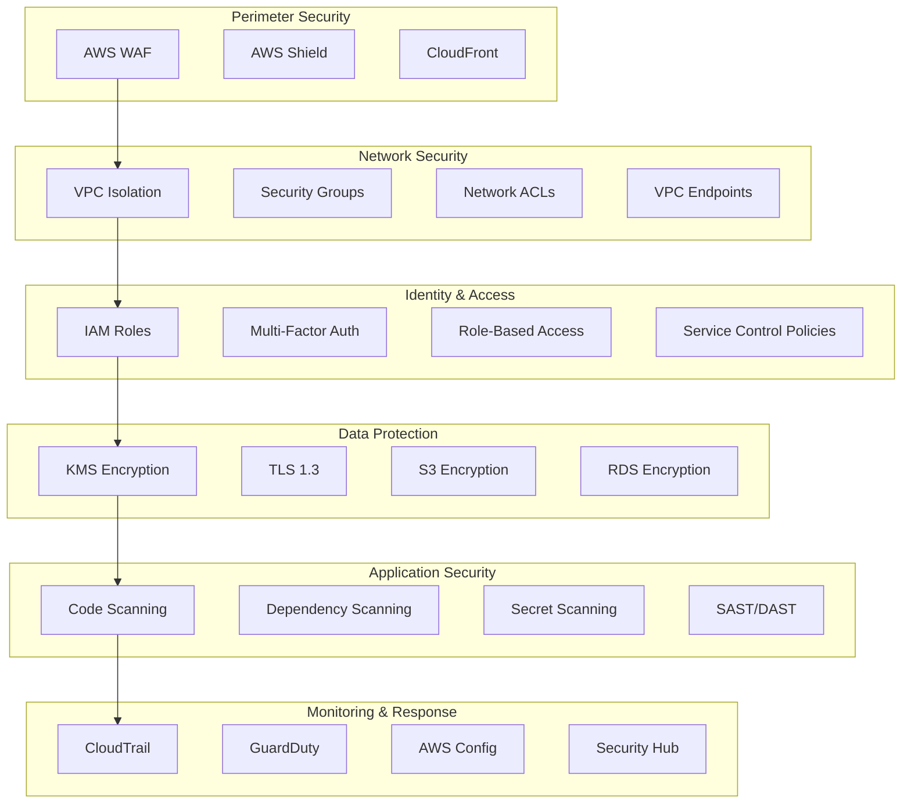

# Security Architecture

Comprehensive security architecture implementing defense-in-depth principles, zero-trust networking, and compliance automation for the DevSecOps Platform.

## Security Design Principles

### 1. Defense in Depth

Multiple layers of security controls to protect against various threat vectors:



### 2. Zero Trust Architecture

Never trust, always verify approach:

- **Identity Verification**: Every user and device must be authenticated
- **Least Privilege**: Minimal required access permissions
- **Micro-Segmentation**: Network segmentation at granular level
- **Continuous Monitoring**: Real-time security monitoring and validation

### 3. Security by Design

Security integrated from the beginning:

- **Secure Defaults**: All components configured securely by default
- **Automated Security**: Security controls automated and enforced
- **Compliance Built-in**: Compliance requirements embedded in design
- **Threat Modeling**: Regular threat modeling and risk assessment

## Network Security Architecture

### 1. VPC Security Design

```python
# Secure VPC Configuration
vpc = ec2.Vpc(
    self,
    "SecureVPC",
    cidr="10.0.0.0/16",
    max_azs=2,
    enable_dns_hostnames=True,
    enable_dns_support=True,
    subnet_configuration=[
        ec2.SubnetConfiguration(
            name="Public",
            subnet_type=ec2.SubnetType.PUBLIC,
            cidr_mask=24
        ),
        ec2.SubnetConfiguration(
            name="Private",
            subnet_type=ec2.SubnetType.PRIVATE_WITH_EGRESS,
            cidr_mask=24
        ),
        ec2.SubnetConfiguration(
            name="Isolated",
            subnet_type=ec2.SubnetType.PRIVATE_ISOLATED,
            cidr_mask=24
        )
    ]
)

# VPC Flow Logs
ec2.FlowLog(
    self,
    "VPCFlowLogs",
    resource_type=ec2.FlowLogResourceType.from_vpc(vpc),
    destination=ec2.FlowLogDestination.to_cloud_watch_logs(
        log_group=logs.LogGroup(
            self,
            "VPCFlowLogsGroup",
            retention=logs.RetentionDays.ONE_MONTH
        )
    ),
    traffic_type=ec2.FlowLogTrafficType.ALL
)
```

### 2. Security Groups Configuration

```python
# Web Application Security Group
web_sg = ec2.SecurityGroup(
    self,
    "WebSecurityGroup",
    vpc=vpc,
    description="Security group for web applications",
    allow_all_outbound=False
)

# Allow HTTPS inbound from ALB only
web_sg.add_ingress_rule(
    alb_sg,
    ec2.Port.tcp(443),
    "HTTPS from ALB"
)

# Allow HTTPS outbound for API calls
web_sg.add_egress_rule(
    ec2.Peer.any_ipv4(),
    ec2.Port.tcp(443),
    "HTTPS outbound"
)

# Database Security Group
db_sg = ec2.SecurityGroup(
    self,
    "DatabaseSecurityGroup",
    vpc=vpc,
    description="Security group for databases",
    allow_all_outbound=False
)

# Allow database access from application tier only
db_sg.add_ingress_rule(
    web_sg,
    ec2.Port.tcp(5432),
    "PostgreSQL from web tier"
)
```

### 3. Network Access Control Lists

```python
# Private Subnet NACL
private_nacl = ec2.NetworkAcl(
    self,
    "PrivateNACL",
    vpc=vpc,
    subnet_selection=ec2.SubnetSelection(
        subnet_type=ec2.SubnetType.PRIVATE_WITH_EGRESS
    )
)

# Allow HTTPS outbound
private_nacl.add_entry(
    "AllowHTTPSOutbound",
    rule_number=100,
    cidr=ec2.AclCidr.any_ipv4(),
    rule_action=ec2.AclTrafficDirection.EGRESS,
    traffic=ec2.AclTraffic.tcp_port(443)
)

# Allow ephemeral ports inbound for return traffic
private_nacl.add_entry(
    "AllowEphemeralInbound",
    rule_number=100,
    cidr=ec2.AclCidr.any_ipv4(),
    rule_action=ec2.AclTrafficDirection.INGRESS,
    traffic=ec2.AclTraffic.tcp_port_range(1024, 65535)
)
```

## Identity and Access Management

### 1. IAM Role Architecture

```python
# Cross-Account Role for Multi-Environment Access
cross_account_role = iam.Role(
    self,
    "CrossAccountRole",
    assumed_by=iam.AccountPrincipal(dev_account_id),
    role_name="DevSecOpsPlatformCrossAccountRole",
    max_session_duration=Duration.hours(4),
    inline_policies={
        "AssumeRolePolicy": iam.PolicyDocument(
            statements=[
                iam.PolicyStatement(
                    effect=iam.Effect.ALLOW,
                    actions=["sts:AssumeRole"],
                    resources=[
                        f"arn:aws:iam::{staging_account_id}:role/DeploymentRole",
                        f"arn:aws:iam::{prod_account_id}:role/DeploymentRole"
                    ],
                    conditions={
                        "StringEquals": {
                            "aws:RequestedRegion": ["us-east-1", "us-west-2"]
                        },
                        "IpAddress": {
                            "aws:SourceIp": ["203.0.113.0/24"]  # Office IP range
                        }
                    }
                )
            ]
        )
    }
)

# Service-Linked Role for Lambda
lambda_role = iam.Role(
    self,
    "LambdaExecutionRole",
    assumed_by=iam.ServicePrincipal("lambda.amazonaws.com"),
    managed_policies=[
        iam.ManagedPolicy.from_aws_managed_policy_name(
            "service-role/AWSLambdaVPCAccessExecutionRole"
        )
    ],
    inline_policies={
        "DataAccess": iam.PolicyDocument(
            statements=[
                iam.PolicyStatement(
                    effect=iam.Effect.ALLOW,
                    actions=[
                        "s3:GetObject",
                        "s3:PutObject"
                    ],
                    resources=[
                        f"{data_bucket.bucket_arn}/*"
                    ],
                    conditions={
                        "StringEquals": {
                            "s3:x-amz-server-side-encryption": "AES256"
                        }
                    }
                )
            ]
        )
    }
)
```

### 2. Multi-Factor Authentication

```python
# MFA Policy for IAM Users
mfa_policy = iam.ManagedPolicy(
    self,
    "MFAPolicy",
    description="Require MFA for all operations",
    statements=[
        iam.PolicyStatement(
            effect=iam.Effect.DENY,
            actions=["*"],
            resources=["*"],
            conditions={
                "BoolIfExists": {
                    "aws:MultiFactorAuthPresent": "false"
                },
                "NumericLessThan": {
                    "aws:MultiFactorAuthAge": "3600"  # 1 hour
                }
            }
        )
    ]
)
```

### 3. Service Control Policies

```python
# Preventive SCP for Production Account
production_scp = {
    "Version": "2012-10-17",
    "Statement": [
        {
            "Effect": "Deny",
            "Action": [
                "ec2:TerminateInstances",
                "rds:DeleteDBInstance",
                "s3:DeleteBucket"
            ],
            "Resource": "*",
            "Condition": {
                "StringNotEquals": {
                    "aws:PrincipalTag/Role": "Administrator"
                }
            }
        },
        {
            "Effect": "Deny",
            "Action": [
                "iam:CreateUser",
                "iam:DeleteUser",
                "iam:CreateRole",
                "iam:DeleteRole"
            ],
            "Resource": "*",
            "Condition": {
                "StringNotEquals": {
                    "aws:RequestedRegion": ["us-east-1", "us-west-2"]
                }
            }
        }
    ]
}
```

## Data Protection Architecture

### 1. Encryption at Rest

```python
# Customer Managed KMS Key
data_key = kms.Key(
    self,
    "DataEncryptionKey",
    description="Customer managed key for data encryption",
    enable_key_rotation=True,
    rotation_schedule=kms.RotationSchedule.rate(Duration.days(365)),
    policy=iam.PolicyDocument(
        statements=[
            iam.PolicyStatement(
                effect=iam.Effect.ALLOW,
                principals=[iam.AccountRootPrincipal()],
                actions=["kms:*"],
                resources=["*"]
            ),
            iam.PolicyStatement(
                effect=iam.Effect.ALLOW,
                principals=[lambda_role],
                actions=[
                    "kms:Decrypt",
                    "kms:GenerateDataKey",
                    "kms:CreateGrant"
                ],
                resources=["*"],
                conditions={
                    "StringEquals": {
                        "kms:ViaService": [
                            f"s3.{Aws.REGION}.amazonaws.com",
                            f"rds.{Aws.REGION}.amazonaws.com"
                        ]
                    }
                }
            )
        ]
    )
)

# S3 Bucket with KMS Encryption
secure_bucket = s3.Bucket(
    self,
    "SecureDataBucket",
    encryption=s3.BucketEncryption.KMS,
    encryption_key=data_key,
    block_public_access=s3.BlockPublicAccess.BLOCK_ALL,
    versioning=True,
    lifecycle_rules=[
        s3.LifecycleRule(
            noncurrent_version_expiration=Duration.days(30)
        )
    ],
    notification_configuration=s3.NotificationConfiguration(
        cloud_watch_configurations=[
            s3.CloudWatchConfiguration(
                event=s3.EventType.OBJECT_CREATED,
                metric_configuration=s3.MetricConfiguration(
                    id="ObjectCreated",
                    prefix="sensitive/"
                )
            )
        ]
    )
)

# RDS with Encryption
encrypted_db = rds.DatabaseInstance(
    self,
    "EncryptedDatabase",
    engine=rds.DatabaseInstanceEngine.postgres(),
    storage_encrypted=True,
    storage_encryption_key=data_key,
    backup_retention=Duration.days(7),
    deletion_protection=True,
    performance_insights_encryption_key=data_key
)
```

### 2. Encryption in Transit

```python
# Application Load Balancer with TLS
alb = elbv2.ApplicationLoadBalancer(
    self,
    "SecureALB",
    vpc=vpc,
    internet_facing=True,
    security_group=alb_sg
)

# HTTPS Listener with TLS 1.2+
https_listener = alb.add_listener(
    "HTTPSListener",
    port=443,
    protocol=elbv2.ApplicationProtocol.HTTPS,
    certificates=[
        elbv2.ListenerCertificate.from_arn(certificate_arn)
    ],
    ssl_policy=elbv2.SslPolicy.TLS12_EXT
)

# Redirect HTTP to HTTPS
alb.add_listener(
    "HTTPListener",
    port=80,
    protocol=elbv2.ApplicationProtocol.HTTP,
    default_action=elbv2.ListenerAction.redirect(
        protocol="HTTPS",
        port="443",
        permanent=True
    )
)
```

### 3. Secrets Management

```python
# Secrets Manager for Database Credentials
db_secret = secretsmanager.Secret(
    self,
    "DatabaseSecret",
    description="Database credentials",
    generate_secret_string=secretsmanager.SecretStringGenerator(
        secret_string_template='{"username": "admin"}',
        generate_string_key="password",
        exclude_characters=" %+~`#$&*()|[]{}:;<>?!'/\"\\",
        password_length=32
    ),
    encryption_key=data_key
)

# Lambda function with secret access
lambda_.Function(
    self,
    "SecureFunction",
    runtime=lambda_.Runtime.PYTHON_3_9,
    handler="index.handler",
    code=lambda_.Code.from_asset("src"),
    environment={
        "DB_SECRET_ARN": db_secret.secret_arn
    },
    role=lambda_role
)

# Grant secret access to Lambda role
db_secret.grant_read(lambda_role)
```

## Application Security

### 1. Web Application Firewall

```python
# WAF Web ACL
web_acl = wafv2.CfnWebACL(
    self,
    "WebACL",
    scope="CLOUDFRONT",
    default_action=wafv2.CfnWebACL.DefaultActionProperty(
        allow={}
    ),
    rules=[
        # AWS Managed Core Rule Set
        wafv2.CfnWebACL.RuleProperty(
            name="AWSManagedRulesCommonRuleSet",
            priority=1,
            override_action=wafv2.CfnWebACL.OverrideActionProperty(
                none={}
            ),
            statement=wafv2.CfnWebACL.StatementProperty(
                managed_rule_group_statement=wafv2.CfnWebACL.ManagedRuleGroupStatementProperty(
                    vendor_name="AWS",
                    name="AWSManagedRulesCommonRuleSet"
                )
            ),
            visibility_config=wafv2.CfnWebACL.VisibilityConfigProperty(
                sampled_requests_enabled=True,
                cloud_watch_metrics_enabled=True,
                metric_name="CommonRuleSetMetric"
            )
        ),
        # Rate Limiting Rule
        wafv2.CfnWebACL.RuleProperty(
            name="RateLimitRule",
            priority=2,
            action=wafv2.CfnWebACL.RuleActionProperty(
                block={}
            ),
            statement=wafv2.CfnWebACL.StatementProperty(
                rate_based_statement=wafv2.CfnWebACL.RateBasedStatementProperty(
                    limit=2000,
                    aggregate_key_type="IP"
                )
            ),
            visibility_config=wafv2.CfnWebACL.VisibilityConfigProperty(
                sampled_requests_enabled=True,
                cloud_watch_metrics_enabled=True,
                metric_name="RateLimitMetric"
            )
        )
    ],
    visibility_config=wafv2.CfnWebACL.VisibilityConfigProperty(
        sampled_requests_enabled=True,
        cloud_watch_metrics_enabled=True,
        metric_name="WebACLMetric"
    )
)
```

### 2. API Security

```python
# API Gateway with Authentication
api = apigateway.RestApi(
    self,
    "SecureAPI",
    rest_api_name="DevSecOps Platform API",
    description="Secure API for the DevSecOps Platform",
    endpoint_configuration=apigateway.EndpointConfiguration(
        types=[apigateway.EndpointType.REGIONAL]
    ),
    policy=iam.PolicyDocument(
        statements=[
            iam.PolicyStatement(
                effect=iam.Effect.ALLOW,
                principals=[iam.AnyPrincipal()],
                actions=["execute-api:Invoke"],
                resources=["*"],
                conditions={
                    "StringEquals": {
                        "aws:SourceVpce": vpc_endpoint.vpc_endpoint_id
                    }
                }
            )
        ]
    )
)

# Cognito User Pool for Authentication
user_pool = cognito.UserPool(
    self,
    "UserPool",
    user_pool_name="platform-users",
    password_policy=cognito.PasswordPolicy(
        min_length=12,
        require_lowercase=True,
        require_uppercase=True,
        require_digits=True,
        require_symbols=True
    ),
    mfa=cognito.Mfa.REQUIRED,
    mfa_second_factor=cognito.MfaSecondFactor(
        sms=True,
        otp=True
    ),
    account_recovery=cognito.AccountRecovery.EMAIL_ONLY
)

# API Gateway Authorizer
authorizer = apigateway.CognitoUserPoolsAuthorizer(
    self,
    "APIAuthorizer",
    cognito_user_pools=[user_pool]
)
```

## Security Monitoring and Detection

### 1. AWS Security Services

```python
# GuardDuty for Threat Detection
guardduty.CfnDetector(
    self,
    "GuardDutyDetector",
    enable=True,
    finding_publishing_frequency="FIFTEEN_MINUTES",
    data_sources=guardduty.CfnDetector.CFNDataSourceConfigurationsProperty(
        s3_logs=guardduty.CfnDetector.CFNS3LogsConfigurationProperty(
            enable=True
        ),
        kubernetes=guardduty.CfnDetector.CFNKubernetesConfigurationProperty(
            audit_logs=guardduty.CfnDetector.CFNKubernetesAuditLogsConfigurationProperty(
                enable=True
            )
        ),
        malware_protection=guardduty.CfnDetector.CFNMalwareProtectionConfigurationProperty(
            scan_ec2_instance_with_findings=guardduty.CfnDetector.CFNScanEc2InstanceWithFindingsConfigurationProperty(
                ebs_volumes=True
            )
        )
    )
)

# AWS Config for Compliance Monitoring
config.CfnConfigurationRecorder(
    self,
    "ConfigRecorder",
    role_arn=config_role.role_arn,
    recording_group=config.CfnConfigurationRecorder.RecordingGroupProperty(
        all_supported=True,
        include_global_resources=True,
        recording_mode_overrides=[
            config.CfnConfigurationRecorder.RecordingModeOverrideProperty(
                resource_types=["AWS::EC2::Instance"],
                recording_mode=config.CfnConfigurationRecorder.RecordingModeProperty(
                    recording_frequency="CONTINUOUS",
                    recording_mode_override_description="Continuous recording for EC2 instances"
                )
            )
        ]
    )
)

# Security Hub for Centralized Security Findings
securityhub.CfnHub(
    self,
    "SecurityHub",
    enable_default_standards=True,
    control_finding_generator="SECURITY_CONTROL",
    auto_enable_controls=True
)
```

### 2. Custom Security Monitoring

```python
# Custom CloudWatch Metrics for Security Events
security_metric = cloudwatch.Metric(
    namespace="Security/Platform",
    metric_name="SecurityEvents",
    dimensions_map={
        "EventType": "UnauthorizedAccess",
        "Environment": environment
    }
)

# Security Event Alarm
cloudwatch.Alarm(
    self,
    "SecurityEventAlarm",
    metric=security_metric,
    threshold=1,
    evaluation_periods=1,
    comparison_operator=cloudwatch.ComparisonOperator.GREATER_THAN_OR_EQUAL_TO_THRESHOLD,
    alarm_description="Security event detected",
    alarm_actions=[security_sns_topic],
    treat_missing_data=cloudwatch.TreatMissingData.NOT_BREACHING
)

# Lambda function for security event processing
security_processor = lambda_.Function(
    self,
    "SecurityEventProcessor",
    runtime=lambda_.Runtime.PYTHON_3_9,
    handler="security_handler.process_event",
    code=lambda_.Code.from_asset("src/security"),
    environment={
        "SECURITY_TOPIC_ARN": security_sns_topic.topic_arn,
        "SLACK_WEBHOOK_URL": slack_webhook_url
    },
    timeout=Duration.minutes(5)
)
```

## Incident Response Architecture

### 1. Automated Response

```python
# Step Functions for Incident Response
incident_response_definition = {
    "Comment": "Automated incident response workflow",
    "StartAt": "ClassifyIncident",
    "States": {
        "ClassifyIncident": {
            "Type": "Task",
            "Resource": classify_lambda.function_arn,
            "Next": "DetermineResponse"
        },
        "DetermineResponse": {
            "Type": "Choice",
            "Choices": [
                {
                    "Variable": "$.severity",
                    "StringEquals": "HIGH",
                    "Next": "ImmediateResponse"
                },
                {
                    "Variable": "$.severity",
                    "StringEquals": "MEDIUM",
                    "Next": "StandardResponse"
                }
            ],
            "Default": "LogIncident"
        },
        "ImmediateResponse": {
            "Type": "Parallel",
            "Branches": [
                {
                    "StartAt": "IsolateResources",
                    "States": {
                        "IsolateResources": {
                            "Type": "Task",
                            "Resource": isolate_lambda.function_arn,
                            "End": True
                        }
                    }
                },
                {
                    "StartAt": "NotifyTeam",
                    "States": {
                        "NotifyTeam": {
                            "Type": "Task",
                            "Resource": notify_lambda.function_arn,
                            "End": True
                        }
                    }
                }
            ],
            "End": True
        }
    }
}

stepfunctions.StateMachine(
    self,
    "IncidentResponseWorkflow",
    definition=stepfunctions.DefinitionBody.from_string(
        json.dumps(incident_response_definition)
    ),
    role=step_functions_role
)
```

### 2. Security Playbooks

```python
# Security playbook for different incident types
security_playbooks = {
    "data_breach": {
        "immediate_actions": [
            "isolate_affected_systems",
            "preserve_evidence",
            "notify_stakeholders"
        ],
        "investigation_steps": [
            "analyze_logs",
            "identify_scope",
            "determine_root_cause"
        ],
        "recovery_actions": [
            "patch_vulnerabilities",
            "restore_services",
            "implement_additional_controls"
        ]
    },
    "unauthorized_access": {
        "immediate_actions": [
            "disable_compromised_accounts",
            "change_passwords",
            "review_access_logs"
        ],
        "investigation_steps": [
            "trace_access_patterns",
            "identify_compromised_resources",
            "assess_damage"
        ],
        "recovery_actions": [
            "strengthen_access_controls",
            "implement_additional_monitoring",
            "conduct_security_training"
        ]
    }
}
```

## Compliance and Governance

### 1. Automated Compliance Checking

```python
# Config Rules for Compliance
config.ManagedRule(
    self,
    "S3BucketEncryptionRule",
    identifier=config.ManagedRuleIdentifiers.S3_BUCKET_SERVER_SIDE_ENCRYPTION_ENABLED,
    description="Check if S3 buckets have encryption enabled"
)

config.ManagedRule(
    self,
    "RDSEncryptionRule",
    identifier=config.ManagedRuleIdentifiers.RDS_STORAGE_ENCRYPTED,
    description="Check if RDS instances have encryption enabled"
)

config.ManagedRule(
    self,
    "IAMPasswordPolicyRule",
    identifier=config.ManagedRuleIdentifiers.IAM_PASSWORD_POLICY,
    description="Check if IAM password policy meets requirements",
    input_parameters={
        "RequireUppercaseCharacters": "true",
        "RequireLowercaseCharacters": "true",
        "RequireSymbols": "true",
        "RequireNumbers": "true",
        "MinimumPasswordLength": "14"
    }
)
```

### 2. Security Metrics and Reporting

```python
# Security dashboard
security_dashboard = cloudwatch.Dashboard(
    self,
    "SecurityDashboard",
    dashboard_name="platform-security-dashboard"
)

security_dashboard.add_widgets(
    cloudwatch.GraphWidget(
        title="Security Events",
        left=[
            cloudwatch.Metric(
                namespace="Security/Platform",
                metric_name="SecurityEvents",
                statistic="Sum"
            )
        ],
        width=12,
        height=6
    ),
    cloudwatch.GraphWidget(
        title="GuardDuty Findings",
        left=[
            cloudwatch.Metric(
                namespace="AWS/GuardDuty",
                metric_name="FindingCount",
                statistic="Sum"
            )
        ],
        width=12,
        height=6
    )
)
```

## Security Best Practices

### 1. Development Security

- **Secure Coding**: Follow OWASP secure coding practices
- **Code Review**: Mandatory security-focused code reviews
- **Static Analysis**: Automated SAST scanning in CI/CD
- **Dependency Management**: Regular dependency vulnerability scanning

### 2. Operational Security

- **Least Privilege**: Implement principle of least privilege
- **Regular Audits**: Conduct regular security audits and assessments
- **Incident Response**: Maintain and test incident response procedures
- **Security Training**: Regular security awareness training

### 3. Infrastructure Security

- **Immutable Infrastructure**: Use immutable infrastructure patterns
- **Network Segmentation**: Implement proper network segmentation
- **Encryption**: Encrypt all data at rest and in transit
- **Monitoring**: Comprehensive security monitoring and alerting

For more detailed information, see:
- [Security Implementation](../security/implementation.md)
- [Compliance Guide](../compliance/soc2.md)
- [Incident Response](../security/incident-response.md)
- [Security Scanning](../security/scanning.md)
