# Enterprise CDK Constructs Library

Comprehensive library of reusable AWS CDK constructs designed to accelerate development by 70% and standardize common patterns across all engineering teams.

## Overview

The DevSecOps Platform Constructs Library provides enterprise-grade, composable building blocks for AWS infrastructure with built-in security, monitoring, compliance, and AI-powered assistance.

### Key Features

- **🚀 70% Development Acceleration**: Pre-built constructs for common patterns
- **🔒 Security by Design**: Built-in encryption, IAM, and compliance controls
- **📊 Comprehensive Monitoring**: CloudWatch, X-Ray, and custom metrics
- **🌍 Multi-Environment**: Automatic configuration for dev/staging/prod
- **🤖 AI-Powered**: MCP integration for intelligent development assistance
- **✅ Quality Assurance**: CDK-Nag and Checkov integration
- **📈 Cost Optimized**: Environment-specific sizing and lifecycle policies

## Architecture

```mermaid
graph TB
    subgraph "Foundation Layer"
        Base[BaseConstruct]
        Types[Type System]
        Config[Environment Config]
        Mixins[Reusable Mixins]
    end
    
    subgraph "Data Ingestion"
        Raw[Raw Data Ingestion]
        Stream[Streaming Ingestion]
        API[API Ingestion]
        DB[Database Ingestion]
        File[File Ingestion]
        Batch[Batch Ingestion]
        RT[Realtime Ingestion]
    end
    
    subgraph "ML/AI"
        Training[SageMaker Training]
        Deploy[Model Deployment]
        FeatureStore[Feature Store]
        Monitor[Model Monitoring]
        BatchInf[Batch Inference]
        RTInf[Realtime Inference]
        Registry[Model Registry]
        AutoML[AutoML]
    end
    
    subgraph "Data Processing"
        ETL[ETL Pipeline]
        Quality[Data Quality]
        Lineage[Data Lineage]
        StreamProc[Stream Processing]
        Transform[Data Transformation]
        Catalog[Data Catalog]
        Governance[Data Governance]
    end
    
    Base --> Raw
    Base --> Training
    Base --> ETL
    Types --> Base
    Config --> Base
    Mixins --> Base
```



## Quick Start

### Installation

```bash
# Install the constructs library
pip install devsecops-platform-constructs

# Or install from source
git clone https://github.com/Exemplify777/aws-cdk-devsecops-platform.git
cd aws-cdk-devsecops-platform
pip install -e infrastructure/constructs/
```

### Basic Usage

```python
from aws_cdk import App, Stack
from infrastructure.constructs import (
    RawDataIngestionConstruct,
    RawDataIngestionProps,
    ConstructProps,
    Environment
)

class DataPipelineStack(Stack):
    def __init__(self, scope: App, construct_id: str, **kwargs):
        super().__init__(scope, construct_id, **kwargs)
        
        # Create raw data ingestion
        raw_ingestion = RawDataIngestionConstruct(
            self,
            "RawDataIngestion",
            RawDataIngestionProps(
                project_name="my-data-pipeline",
                environment=Environment.DEV,
                enable_data_validation=True,
                lambda_memory_size=1024
            )
        )

app = App()
DataPipelineStack(app, "DataPipelineStack")
app.synth()
```

## Foundation Components

### BaseConstruct

All constructs inherit from `BaseConstruct`, providing:

- **Security**: KMS encryption, IAM roles, security monitoring
- **Monitoring**: CloudWatch metrics, alarms, and dashboards
- **Validation**: Input validation and compliance checking
- **Configuration**: Environment-specific settings
- **Tagging**: Standardized resource tagging

```python
from infrastructure.constructs.common import BaseConstruct, ConstructProps

class MyCustomConstruct(BaseConstruct):
    def __init__(self, scope, construct_id: str, props: ConstructProps):
        super().__init__(scope, construct_id, props)
        
        # Your construct implementation
        self._create_resources()
    
    def _create_resources(self) -> None:
        # Implement your resources
        pass
    
    def _setup_monitoring_metrics(self) -> List[cloudwatch.Metric]:
        # Define monitoring metrics
        return []
```

### Type System

Comprehensive type definitions for type safety:

```python
from infrastructure.constructs.common.types import (
    ConstructProps,
    Environment,
    SecurityConfig,
    MonitoringConfig,
    SecurityLevel,
    MonitoringLevel
)

# Create props with type safety
props = ConstructProps(
    project_name="my-project",
    environment=Environment.PROD,
    security_config=SecurityConfig(
        level=SecurityLevel.HIGH,
        encryption_enabled=True,
        compliance_frameworks=["soc2", "iso27001"]
    ),
    monitoring_config=MonitoringConfig(
        level=MonitoringLevel.COMPREHENSIVE,
        enable_detailed_monitoring=True
    )
)
```

### Environment Configuration

Automatic environment-specific configuration:

```python
from infrastructure.constructs.common.config import EnvironmentConfig

# Load environment configuration
config = EnvironmentConfig(Environment.PROD)

# Get environment-specific settings
vpc_cidr = config.get("vpc.cidr")  # "10.2.0.0/16" for prod
instance_type = config.get("instance_types.lambda_memory")  # 1024 for prod
security_level = config.get("security.level")  # "high" for prod
```

## Data Ingestion Constructs

### RawDataIngestionConstruct

S3 → Lambda → Glue Crawler pattern with automatic schema detection.

```python
from infrastructure.constructs.data_ingestion import (
    RawDataIngestionConstruct,
    RawDataIngestionProps
)

raw_ingestion = RawDataIngestionConstruct(
    self,
    "RawDataIngestion",
    RawDataIngestionProps(
        project_name="analytics-platform",
        environment=Environment.PROD,
        # S3 Configuration
        enable_versioning=True,
        enable_lifecycle_policies=True,
        # Lambda Configuration
        lambda_memory_size=1024,
        lambda_timeout_minutes=15,
        # Glue Configuration
        enable_schema_evolution=True,
        crawler_schedule="cron(0 2 * * ? *)",  # Daily at 2 AM
        # Data Validation
        enable_data_validation=True,
        validation_rules={
            "required_columns": ["id", "timestamp", "data"],
            "data_types": {"id": "string", "timestamp": "timestamp"}
        },
        # Error Handling
        enable_dlq=True,
        max_retry_attempts=3
    )
)
```

**Features:**
- Automatic schema detection and evolution
- Data validation with configurable rules
- Error handling with dead letter queues
- S3 lifecycle policies for cost optimization
- Comprehensive monitoring and alerting

### StreamingIngestionConstruct

Kinesis Data Streams → Lambda → S3 pattern with auto-scaling.

```python
from infrastructure.constructs.data_ingestion import (
    StreamingIngestionConstruct,
    StreamingIngestionProps
)

streaming_ingestion = StreamingIngestionConstruct(
    self,
    "StreamingIngestion",
    StreamingIngestionProps(
        project_name="real-time-analytics",
        environment=Environment.PROD,
        # Kinesis Configuration
        shard_count=4,
        retention_hours=24,
        enable_enhanced_fanout=True,
        # Lambda Configuration
        batch_size=100,
        max_batching_window_seconds=5,
        parallelization_factor=2,
        # Auto Scaling
        enable_auto_scaling=True,
        min_shards=2,
        max_shards=20,
        target_utilization=70.0,
        # Firehose (Optional)
        enable_firehose=True,
        firehose_buffer_size_mb=5,
        # Output Configuration
        output_format="parquet",
        enable_compression=True,
        partitioning_keys=["year", "month", "day", "hour"]
    )
)
```

**Features:**
- Auto-scaling based on stream utilization
- Enhanced fan-out for high throughput
- Optional Kinesis Data Firehose delivery
- Batch processing with configurable windows
- Error handling with DLQ and bisect on error

### ApiIngestionConstruct

API Gateway → Lambda → S3 pattern with authentication and WAF.

```python
from infrastructure.constructs.data_ingestion import (
    ApiIngestionConstruct,
    ApiIngestionProps
)

api_ingestion = ApiIngestionConstruct(
    self,
    "ApiIngestion",
    ApiIngestionProps(
        project_name="data-collection-api",
        environment=Environment.PROD,
        # API Configuration
        api_name="data-ingestion-api",
        enable_cors=True,
        cors_origins=["https://myapp.com"],
        # Authentication
        enable_authentication=True,
        auth_type="cognito",
        create_user_pool=True,
        # Rate Limiting
        enable_rate_limiting=True,
        throttle_rate_limit=1000,
        throttle_burst_limit=2000,
        # Request Validation
        enable_request_validation=True,
        request_schema={
            "data": {"type": "object"},
            "timestamp": {"type": "string", "format": "date-time"}
        },
        max_request_size_mb=10,
        # WAF Protection
        enable_waf=True,
        enable_geo_blocking=True,
        blocked_countries=["CN", "RU"],
        # Output Configuration
        enable_data_partitioning=True,
        partition_keys=["year", "month", "day"]
    )
)
```

**Features:**
- Cognito User Pool authentication
- WAF protection with rate limiting
- Request validation and schema enforcement
- CORS support and geo-blocking
- Data partitioning for optimal storage

## Best Practices

### Security

1. **Always Enable Encryption**:
   ```python
   props = ConstructProps(
       security_config=SecurityConfig(
           encryption_enabled=True,
           encryption_key_rotation=True
       )
   )
   ```

2. **Use Least Privilege IAM**:
   ```python
   # Constructs automatically create least privilege roles
   # Additional permissions can be added as needed
   construct.lambda_role.add_to_policy(
       iam.PolicyStatement(
           effect=iam.Effect.ALLOW,
           actions=["s3:GetObject"],
           resources=["arn:aws:s3:::specific-bucket/*"]
       )
   )
   ```

3. **Enable Audit Logging**:
   ```python
   props = ConstructProps(
       security_config=SecurityConfig(
           audit_logging=True,
           compliance_frameworks=["soc2"]
       )
   )
   ```

### Monitoring

1. **Use Environment-Appropriate Monitoring**:
   ```python
   # Production gets comprehensive monitoring
   prod_props = ConstructProps(
       environment=Environment.PROD,
       monitoring_config=MonitoringConfig(
           level=MonitoringLevel.COMPREHENSIVE,
           enable_detailed_monitoring=True,
           enable_x_ray_tracing=True
       )
   )
   
   # Development gets basic monitoring
   dev_props = ConstructProps(
       environment=Environment.DEV,
       monitoring_config=MonitoringConfig(
           level=MonitoringLevel.BASIC
       )
   )
   ```

2. **Set Up Custom Metrics**:
   ```python
   # Constructs automatically create relevant metrics
   # Access them for custom dashboards
   metrics = construct._setup_monitoring_metrics()
   
   # Create custom dashboard
   dashboard = cloudwatch.Dashboard(
       self,
       "CustomDashboard",
       widgets=[
           cloudwatch.GraphWidget(
               title="Processing Metrics",
               left=metrics
           )
       ]
   )
   ```

### Cost Optimization

1. **Use Environment-Specific Sizing**:
   ```python
   # Constructs automatically size resources based on environment
   # Override for specific needs
   props = RawDataIngestionProps(
       environment=Environment.DEV,
       lambda_memory_size=512,  # Smaller for dev
       enable_lifecycle_policies=True
   )
   ```

2. **Enable Lifecycle Policies**:
   ```python
   props = RawDataIngestionProps(
       enable_lifecycle_policies=True,  # Automatic S3 lifecycle
       cost_config=CostConfig(
           lifecycle_policies_enabled=True,
           spot_instances_enabled=True  # For dev environments
       )
   )
   ```

## Testing

### Unit Testing

```python
import pytest
from aws_cdk import App, Stack
from infrastructure.constructs.data_ingestion import (
    RawDataIngestionConstruct,
    RawDataIngestionProps
)

def test_raw_data_ingestion_construct():
    app = App()
    stack = Stack(app, "TestStack")
    
    construct = RawDataIngestionConstruct(
        stack,
        "TestConstruct",
        RawDataIngestionProps(
            project_name="test-project",
            environment=Environment.DEV
        )
    )
    
    # Validate construct properties
    assert construct.raw_bucket is not None
    assert construct.data_processor is not None
    assert construct.glue_database is not None
    
    # Validate security configuration
    assert construct.encryption_key is not None
    assert construct.lambda_role is not None
```

### Integration Testing

```python
import boto3
from moto import mock_s3, mock_lambda

@mock_s3
@mock_lambda
def test_data_processing_integration():
    # Test actual data processing logic
    s3_client = boto3.client('s3', region_name='us-east-1')
    lambda_client = boto3.client('lambda', region_name='us-east-1')
    
    # Create test bucket
    s3_client.create_bucket(Bucket='test-bucket')
    
    # Upload test data
    s3_client.put_object(
        Bucket='test-bucket',
        Key='test-data.json',
        Body='{"test": "data"}'
    )
    
    # Test processing logic
    # ... implementation
```

## Migration Guide

### From Existing Infrastructure

1. **Assess Current Infrastructure**:
   ```bash
   # Use the assessment tool
   ddk-cli assess --stack-name MyExistingStack
   ```

2. **Create Migration Plan**:
   ```python
   # Gradually replace resources with constructs
   # Start with new resources, then migrate existing ones
   ```

3. **Validate Migration**:
   ```bash
   # Compare before and after
   ddk-cli diff --before existing-template.yaml --after new-template.yaml
   ```

## Troubleshooting

### Common Issues

1. **Import Errors**:
   ```bash
   # Ensure proper installation
   pip install -e infrastructure/constructs/
   ```

2. **Type Errors**:
   ```bash
   # Run type checking
   mypy infrastructure/constructs/
   ```

3. **Deployment Failures**:
   ```bash
   # Check construct validation
   cdk synth --strict
   ```

### Debug Mode

```python
# Enable debug logging
props = ConstructProps(
    project_name="debug-project",
    environment=Environment.DEV,
    # Debug settings automatically applied for dev
)

# Check construct metadata
metadata = construct.get_metadata()
print(f"Construct type: {metadata['construct_type']}")
print(f"Environment: {metadata['environment']}")
```

## Contributing

### Adding New Constructs

1. **Inherit from BaseConstruct**:
   ```python
   class MyNewConstruct(BaseConstruct):
       def __init__(self, scope, construct_id: str, props: MyConstructProps):
           super().__init__(scope, construct_id, props)
   ```

2. **Follow Naming Conventions**:
   ```python
   # Use descriptive names ending with "Construct"
   class DataWarehouseConstruct(BaseConstruct):
       pass
   ```

3. **Implement Required Methods**:
   ```python
   def _create_resources(self) -> None:
       # Create AWS resources
       pass
   
   def _setup_monitoring_metrics(self) -> List[cloudwatch.Metric]:
       # Define monitoring metrics
       return []
   ```

4. **Add Comprehensive Tests**:
   ```python
   # Unit tests, integration tests, and examples
   ```

### Code Quality

- **Type Safety**: Use mypy for type checking
- **Security**: Follow security best practices
- **Testing**: Maintain >90% test coverage
- **Documentation**: Document all public APIs

For more information, see:
- [Construct Patterns](construct-patterns.md)
- [MCP Integration](mcp-integration.md)
- [Quality Assurance](quality-assurance.md)
- [API Reference](../api/constructs.md)
