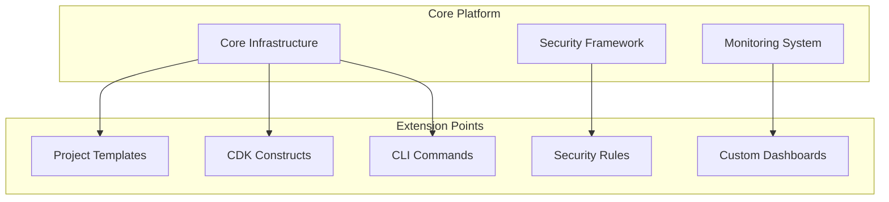

# Extending the Platform

This guide explains how to extend and customize the DevSecOps Platform for your specific needs.

## Extension Points

The platform is designed with several extension points:



## Creating Custom Project Templates

### Template Structure

Project templates use cookiecutter for templating:

```
templates/custom-template/
├── cookiecutter.json           # Template configuration
├── {{ cookiecutter.project_slug }}/  # Template directory
│   ├── README.md
│   ├── app.py
│   ├── cdk.json
│   ├── requirements.txt
│   ├── infrastructure/
│   │   ├── stacks/
│   │   └── constructs/
│   ├── src/
│   │   ├── lambda/
│   │   └── glue/
│   └── tests/
└── hooks/                      # Template hooks
    ├── pre_gen_project.py
    └── post_gen_project.py
```

### Template Configuration

The `cookiecutter.json` file defines template variables:

```json
{
  "project_name": "My Custom Project",
  "project_slug": "{{ cookiecutter.project_name|lower|replace(' ', '-') }}",
  "project_description": "A custom project template",
  "author_name": "Your Name",
  "author_email": "your.email@company.com",
  "aws_region": "us-east-1",
  "environment": ["dev", "staging", "prod"],
  "include_monitoring": ["yes", "no"],
  "include_security": ["yes", "no"],
  "data_source_type": ["s3", "rds", "dynamodb", "api"],
  "processing_type": ["batch", "streaming", "real-time"],
  "output_format": ["parquet", "csv", "json", "database"],
  "_copy_without_render": [
    "*.html",
    "*.js"
  ]
}
```

### Template Hooks

Pre and post generation hooks allow for custom logic:

```python
# hooks/pre_gen_project.py
import re
import sys

# Validate project_slug
MODULE_REGEX = r'^[a-z][a-z0-9\-_]+$'
project_slug = '{{ cookiecutter.project_slug }}'

if not re.match(MODULE_REGEX, project_slug):
    print(f'ERROR: {project_slug} is not a valid project name!')
    sys.exit(1)
```

```python
# hooks/post_gen_project.py
import os
import subprocess

# Initialize git repository
subprocess.run(['git', 'init'])

# Create initial commit
subprocess.run(['git', 'add', '.'])
subprocess.run(['git', 'commit', '-m', 'Initial project structure'])

# Remove optional components
if '{{ cookiecutter.include_monitoring }}' == 'no':
    monitoring_dir = os.path.join('infrastructure', 'stacks', 'monitoring_stack.py')
    if os.path.exists(monitoring_dir):
        os.remove(monitoring_dir)
```

### Registering Custom Templates

Add your template to the platform:

```bash
# Copy template to templates directory
cp -r my-custom-template/ templates/

# Register template in CLI
python -c "from platform.cli.templates import TemplateManager; TemplateManager().register_template('my-custom-template')"
```

## Creating Custom CDK Constructs

### Construct Structure

Create reusable CDK constructs:

```python
# infrastructure/constructs/custom_data_lake.py
from aws_cdk import (
    aws_s3 as s3,
    aws_glue as glue,
    aws_iam as iam,
    RemovalPolicy,
    Tags
)
from constructs import Construct


class DataLakeConstruct(Construct):
    """Custom data lake construct with raw, processed, and curated zones."""
    
    def __init__(
        self,
        scope: Construct,
        construct_id: str,
        environment: str,
        **kwargs
    ) -> None:
        super().__init__(scope, construct_id, **kwargs)
        
        # Create S3 buckets for data lake zones
        self.raw_bucket = s3.Bucket(
            self,
            "RawBucket",
            bucket_name=f"{construct_id}-raw-{environment}",
            encryption=s3.BucketEncryption.S3_MANAGED,
            block_public_access=s3.BlockPublicAccess.BLOCK_ALL,
            removal_policy=RemovalPolicy.RETAIN,
            lifecycle_rules=[
                s3.LifecycleRule(
                    transitions=[
                        s3.Transition(
                            storage_class=s3.StorageClass.INTELLIGENT_TIERING,
                            transition_after=Duration.days(30)
                        )
                    ]
                )
            ]
        )
        
        self.processed_bucket = s3.Bucket(
            self,
            "ProcessedBucket",
            bucket_name=f"{construct_id}-processed-{environment}",
            encryption=s3.BucketEncryption.S3_MANAGED,
            block_public_access=s3.BlockPublicAccess.BLOCK_ALL,
            removal_policy=RemovalPolicy.RETAIN
        )
        
        self.curated_bucket = s3.Bucket(
            self,
            "CuratedBucket",
            bucket_name=f"{construct_id}-curated-{environment}",
            encryption=s3.BucketEncryption.S3_MANAGED,
            block_public_access=s3.BlockPublicAccess.BLOCK_ALL,
            removal_policy=RemovalPolicy.RETAIN
        )
        
        # Create Glue Database
        self.database = glue.CfnDatabase(
            self,
            "DataLakeDatabase",
            catalog_id=Aws.ACCOUNT_ID,
            database_input=glue.CfnDatabase.DatabaseInputProperty(
                name=f"{construct_id}_database_{environment}",
                description=f"Data lake database for {construct_id} in {environment}"
            )
        )
        
        # Create IAM role for Glue
        self.glue_role = iam.Role(
            self,
            "GlueRole",
            assumed_by=iam.ServicePrincipal("glue.amazonaws.com"),
            managed_policies=[
                iam.ManagedPolicy.from_aws_managed_policy_name("service-role/AWSGlueServiceRole")
            ]
        )
        
        # Grant permissions
        self.raw_bucket.grant_read_write(self.glue_role)
        self.processed_bucket.grant_read_write(self.glue_role)
        self.curated_bucket.grant_read(self.glue_role)
        
        # Add tags
        Tags.of(self).add("Component", "DataLake")
        Tags.of(self).add("Environment", environment)
```

### Using Custom Constructs

Use your construct in a stack:

```python
# infrastructure/stacks/data_pipeline_stack.py
from aws_cdk import Stack
from constructs import Construct
from typing import Dict, Any

from infrastructure.constructs.custom_data_lake import DataLakeConstruct


class DataPipelineStack(Stack):
    """Data pipeline stack for ETL/ELT processing."""
    
    def __init__(
        self,
        scope: Construct,
        construct_id: str,
        env_config: Dict[str, Any],
        vpc,
        security_groups,
        **kwargs
    ) -> None:
        super().__init__(scope, construct_id, **kwargs)
        
        # Create data lake
        self.data_lake = DataLakeConstruct(
            self,
            "DataLake",
            environment=env_config["environment_name"]
        )
        
        # Use data lake in other resources
        # ...
```

## Extending the CLI

### Adding Custom Commands

Add new commands to the CLI:

```python
# platform/cli/custom_commands.py
import typer
from rich.console import Console
from rich.panel import Panel

from platform.cli.config import CLIConfig

custom_app = typer.Typer()
console = Console()


@custom_app.command()
def data_quality(
    project: str = typer.Argument(..., help="Project name"),
    environment: str = typer.Option("dev", "--env", "-e", help="Environment"),
    threshold: float = typer.Option(0.95, "--threshold", "-t", help="Quality threshold")
):
    """Run data quality checks on a project."""
    console.print(Panel.fit(f"🔍 Running data quality checks for {project}", style="bold blue"))
    
    config = CLIConfig()
    
    # Implement data quality logic here
    # ...
    
    console.print(f"✅ Data quality checks completed with score: {0.98}")
```

### Registering Custom Commands

Register your commands with the main CLI:

```python
# platform/cli/main.py
from platform.cli.custom_commands import custom_app

# Add custom commands to main app
app.add_typer(custom_app, name="data-quality", help="Data quality commands")
```

### Using Custom Commands

Use your new commands:

```bash
# Run data quality checks
ddk-cli data-quality my-project --env dev --threshold 0.9
```

## Adding Custom Security Rules

### Creating Custom Rules

Create custom security rules:

```yaml
# security/rules/custom_rules.yaml
rules:
  - id: CUSTOM-001
    name: S3 Bucket Encryption
    description: Ensure all S3 buckets have encryption enabled
    severity: HIGH
    framework: SOC2
    control: CC6.1
    check:
      type: resource
      resource_type: AWS::S3::Bucket
      property: BucketEncryption
      operator: exists
    remediation: |
      Add encryption configuration to the S3 bucket:
      ```python
      s3.Bucket(
          self,
          "MyBucket",
          encryption=s3.BucketEncryption.S3_MANAGED
      )
      ```

  - id: CUSTOM-002
    name: Lambda Function Timeout
    description: Ensure Lambda functions have appropriate timeout
    severity: MEDIUM
    framework: INTERNAL
    control: PERF-001
    check:
      type: resource
      resource_type: AWS::Lambda::Function
      property: Timeout
      operator: less_than
      value: 900
    remediation: |
      Set an appropriate timeout for Lambda functions:
      ```python
      lambda_.Function(
          self,
          "MyFunction",
          timeout=Duration.seconds(300)
      )
      ```
```

### Registering Custom Rules

Register your rules with the security scanner:

```python
# security/scanner.py
def load_custom_rules():
    """Load custom security rules."""
    custom_rules_path = os.path.join(
        os.path.dirname(__file__),
        "rules",
        "custom_rules.yaml"
    )
    
    if os.path.exists(custom_rules_path):
        with open(custom_rules_path, "r") as f:
            return yaml.safe_load(f)
    
    return {"rules": []}
```

### Using Custom Rules

Use your custom rules in scans:

```bash
# Run security scan with custom rules
python security/scanner.py scan . --type infra --rules custom
```

## Creating Custom Dashboards

### Dashboard Definition

Create custom CloudWatch dashboards:

```python
# monitoring/dashboards/custom_dashboard.py
from aws_cdk import (
    aws_cloudwatch as cloudwatch,
    Duration
)
from constructs import Construct


def create_custom_dashboard(
    scope: Construct,
    id: str,
    project_name: str,
    environment: str
):
    """Create a custom monitoring dashboard."""
    dashboard = cloudwatch.Dashboard(
        scope,
        id,
        dashboard_name=f"{project_name}-{environment}-dashboard"
    )
    
    # Add widgets to dashboard
    dashboard.add_widgets(
        # Lambda metrics
        cloudwatch.GraphWidget(
            title="Lambda Execution Metrics",
            left=[
                cloudwatch.Metric(
                    namespace="AWS/Lambda",
                    metric_name="Invocations",
                    dimensions_map={
                        "FunctionName": f"{project_name}-processor-{environment}"
                    },
                    statistic="Sum",
                    period=Duration.minutes(5)
                ),
                cloudwatch.Metric(
                    namespace="AWS/Lambda",
                    metric_name="Errors",
                    dimensions_map={
                        "FunctionName": f"{project_name}-processor-{environment}"
                    },
                    statistic="Sum",
                    period=Duration.minutes(5)
                )
            ],
            right=[
                cloudwatch.Metric(
                    namespace="AWS/Lambda",
                    metric_name="Duration",
                    dimensions_map={
                        "FunctionName": f"{project_name}-processor-{environment}"
                    },
                    statistic="Average",
                    period=Duration.minutes(5)
                )
            ],
            width=12,
            height=6
        ),
        
        # Custom business metrics
        cloudwatch.GraphWidget(
            title="Business Metrics",
            left=[
                cloudwatch.Metric(
                    namespace="Custom/DataPipeline",
                    metric_name="RecordsProcessed",
                    dimensions_map={
                        "Project": project_name,
                        "Environment": environment
                    },
                    statistic="Sum",
                    period=Duration.minutes(5)
                ),
                cloudwatch.Metric(
                    namespace="Custom/DataPipeline",
                    metric_name="ProcessingTime",
                    dimensions_map={
                        "Project": project_name,
                        "Environment": environment
                    },
                    statistic="Average",
                    period=Duration.minutes(5)
                )
            ],
            width=12,
            height=6
        )
    )
    
    return dashboard
```

### Using Custom Dashboards

Use your dashboard in a stack:

```python
# infrastructure/stacks/monitoring_stack.py
from monitoring.dashboards.custom_dashboard import create_custom_dashboard

# In MonitoringStack.__init__
self.custom_dashboard = create_custom_dashboard(
    self,
    "CustomDashboard",
    project_name=self.env_config["project_name"],
    environment=self.environment_name
)
```

## Best Practices for Extensions

1. **Modularity**: Create self-contained, reusable components
2. **Documentation**: Document all extension points and customizations
3. **Testing**: Write tests for custom components
4. **Version Control**: Track all extensions in version control
5. **Backward Compatibility**: Maintain compatibility with the core platform
6. **Security**: Follow security best practices in all extensions
7. **Performance**: Consider performance implications of extensions
8. **Maintainability**: Write clean, maintainable code
9. **Compliance**: Ensure extensions meet compliance requirements
10. **Collaboration**: Share extensions with the community

## Next Steps

- [Contributing Guide](contributing.md): How to contribute to the platform
- [API Reference](../api/index.md): Platform API documentation
- [Examples](../examples/index.md): Example extensions and customizations
