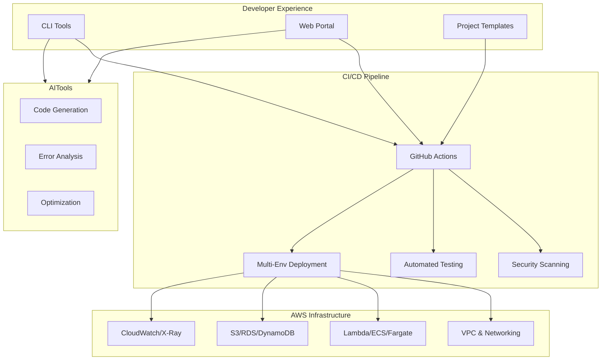

# DevSecOps Platform Documentation

Welcome to the comprehensive documentation for the DevSecOps Platform for Data & AI Organization. This platform provides enterprise-grade infrastructure, security, compliance, and operational excellence for data engineering and AI/ML workloads.

## 🚀 Quick Start

Get up and running in under 30 minutes:

1. **[Installation Guide](getting-started/installation.md)** - Set up your development environment
2. **[Quick Start Tutorial](getting-started/quickstart.md)** - Create and deploy your first project
3. **[Architecture Overview](architecture/overview.md)** - Understand the platform architecture

## 📚 Documentation Sections

### Getting Started
- **[Installation Guide](getting-started/installation.md)** - Complete installation and setup instructions
- **[Quick Start Tutorial](getting-started/quickstart.md)** - Step-by-step tutorial for your first project
- **[Configuration](getting-started/configuration.md)** - Environment and CLI configuration

### Architecture
- **[Overview](architecture/overview.md)** - High-level architecture and design principles
- **[Infrastructure](architecture/infrastructure.md)** - Detailed infrastructure components
- **[Security Architecture](architecture/security.md)** - Security design and controls
- **[Data Architecture](architecture/data.md)** - Data flow and processing architecture

### User Guide
- **[CLI Reference](user-guide/cli.md)** - Complete CLI command reference
- **[Project Templates](user-guide/templates.md)** - Available project templates and customization
- **[Web Portal](user-guide/portal.md)** - Self-service web portal usage
- **[Best Practices](user-guide/best-practices.md)** - Development and deployment best practices

### Security
- **[Security Overview](security/overview.md)** - Comprehensive security framework
- **[Security Scanning](security/scanning.md)** - Automated security scanning and validation
- **[Compliance](security/compliance.md)** - SOC 2, ISO 27001, and GDPR compliance
- **[Implementation Guide](security/implementation.md)** - Security implementation details

### Operations
- **[Deployment Guide](operations/deployment.md)** - Multi-environment deployment strategies
- **[Monitoring](operations/monitoring.md)** - Comprehensive monitoring and observability
- **[CI/CD](operations/cicd.md)** - Continuous integration and deployment
- **[Troubleshooting](operations/troubleshooting.md)** - Common issues and solutions

### Developer Guide
- **[Development Setup](developer-guide/setup.md)** - Local development environment setup
- **[Extending the Platform](developer-guide/extending.md)** - Creating custom components
- **[Contributing](developer-guide/contributing.md)** - How to contribute to the platform
- **[Testing](developer-guide/testing.md)** - Testing strategies and guidelines

### API Reference
- **[CLI API](api/cli.md)** - CLI command reference and examples
- **[Python API](api/python.md)** - Python SDK and library reference
- **[REST API](api/rest.md)** - Web portal and service APIs

## 🚀 Key Features

### **Security by Design**
- Comprehensive security scanning (SAST, DAST, dependency checks)
- Automated compliance checking for SOC 2, ISO 27001, and GDPR
- Encryption at rest and in transit
- IAM least privilege access controls
- Network isolation with VPC and security groups

### **AI-Powered Development**
- Intelligent code generation for data pipelines
- Automated error analysis and remediation suggestions
- Code optimization recommendations
- Template-based project generation

### **Multi-Environment Support**
- Automated deployment pipelines (dev → staging → prod)
- Environment-specific configurations
- Approval gates and rollback capabilities
- Infrastructure as Code with AWS CDK

### **Comprehensive Monitoring**
- Real-time dashboards and alerting
- Performance metrics and cost optimization
- Log aggregation and analysis
- Health checks and automated remediation

### **Self-Service Portal**
- Web-based project management interface
- CLI tools for developers
- Template marketplace
- Deployment automation

## 🏗️ Architecture Overview



## 🎯 Use Cases

### **Data Engineering Teams**
- Build scalable ETL/ELT pipelines
- Implement real-time streaming analytics
- Manage data lakes and warehouses
- Ensure data quality and governance

### **ML Engineering Teams**
- Deploy ML training and inference pipelines
- Manage model lifecycle and versioning
- Implement MLOps best practices
- Scale ML workloads efficiently

### **Platform Teams**
- Provide self-service capabilities to development teams
- Enforce security and compliance policies
- Monitor and optimize infrastructure costs
- Maintain operational excellence

### **Security Teams**
- Implement security-by-design principles
- Automate compliance checking and reporting
- Monitor for security threats and vulnerabilities
- Ensure data protection and privacy

## 🚦 Getting Started

### Quick Start (5 minutes)

1. **Install the CLI**
   ```bash
   pip install ddk-cli
   ddk-cli init
   ```

2. **Create your first project**
   ```bash
   ddk-cli create-project my-data-pipeline --template data-pipeline
   cd my-data-pipeline
   ```

3. **Deploy to AWS**
   ```bash
   ddk-cli deploy --env dev
   ```

### What You Get

- ✅ Complete AWS infrastructure (VPC, Lambda, S3, RDS, etc.)
- ✅ Security controls and monitoring
- ✅ CI/CD pipeline with GitHub Actions
- ✅ Automated testing and quality checks
- ✅ Compliance reporting and documentation

## 📚 Documentation Structure

- **[Getting Started](getting-started/quickstart.md)** - Installation and first steps
- **[Architecture](architecture/overview.md)** - Platform design and components
- **[User Guide](user-guide/cli.md)** - Day-to-day usage and workflows
- **[Developer Guide](developer-guide/setup.md)** - Contributing and extending
- **[Operations](operations/deployment.md)** - Deployment and maintenance
- **[Security](security/overview.md)** - Security features and compliance
- **[API Reference](api/cli.md)** - Complete API documentation

## 🛡️ Security & Compliance

This platform is designed to meet enterprise security and compliance requirements:

- **SOC 2 Type II** compliance framework
- **ISO 27001** information security management
- **GDPR** data protection and privacy
- **Automated security scanning** in CI/CD pipeline
- **Vulnerability management** and remediation
- **Audit logging** and compliance reporting

## 🤝 Community & Support

- **GitHub Issues**: [Report bugs and request features](https://github.com/your-org/mcp-cdk-ddk/issues)
- **Slack Channel**: [#devsecops-platform](https://your-org.slack.com/channels/devsecops-platform)
- **Documentation**: [Complete documentation](https://your-org.github.io/mcp-cdk-ddk)
- **Contributing**: [Contribution guidelines](developer-guide/contributing.md)

## 📈 Roadmap

### Current Version (v1.0)
- ✅ Core infrastructure stacks
- ✅ Security and compliance automation
- ✅ CLI tools and project templates
- ✅ CI/CD pipeline integration
- ✅ Basic AI-powered tools

### Upcoming Features (v1.1)
- 🔄 Advanced ML pipeline templates
- 🔄 Cost optimization recommendations
- 🔄 Multi-cloud support (Azure, GCP)
- 🔄 Enhanced AI code generation
- 🔄 Real-time collaboration features

### Future Vision (v2.0)
- 🔮 Fully autonomous infrastructure management
- 🔮 Advanced AI-driven optimization
- 🔮 Integrated data marketplace
- 🔮 Cross-platform compatibility
- 🔮 Enterprise federation support

## 📄 License

This project is licensed under the MIT License - see the [LICENSE](LICENSE) file for details.

---

**Ready to get started?** Check out our [Quick Start Guide](getting-started/quick-start.md) or explore the [Architecture Overview](architecture/overview.md) to understand how everything works together.
