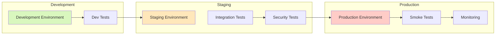

# Deployment Guide

This guide covers the deployment process for the DevSecOps Platform and projects created with it.

## Deployment Architecture

The platform uses a multi-environment deployment strategy with progressive promotion:



## Deployment Environments

| Environment | Purpose | Characteristics | Approval Required |
|-------------|---------|-----------------|-------------------|
| **Development** | Rapid iteration and testing | - Lower resources<br>- Auto-scaling limited<br>- Short retention periods | No |
| **Staging** | Production-like validation | - Production-like sizing<br>- Full monitoring<br>- Extended retention | Manual |
| **Production** | Live workloads | - High availability<br>- Disaster recovery<br>- Full compliance | Manual + Security Review |

## Deployment Methods

### 1. CLI Deployment

The simplest way to deploy is using the CLI:

```bash
# Deploy to development environment
ddk-cli deploy --env dev

# Deploy to staging environment
ddk-cli deploy --env staging

# Deploy to production environment
ddk-cli deploy --env prod --approve
```

### 2. CI/CD Deployment

For automated deployments, use the GitHub Actions workflows:

```yaml
# .github/workflows/cd.yml
name: Continuous Deployment

on:
  push:
    branches:
      - main      # Deploy to dev
      - staging   # Deploy to staging
      - prod      # Deploy to production
  workflow_dispatch:
    inputs:
      environment:
        description: 'Environment to deploy to'
        required: true
        default: 'dev'
        type: choice
        options:
          - dev
          - staging
          - prod
```

### 3. Manual CDK Deployment

For advanced scenarios, use CDK directly:

```bash
# Synthesize CloudFormation templates
cdk synth --context environment=dev

# Deploy all stacks
cdk deploy --all --context environment=dev

# Deploy specific stack
cdk deploy CoreInfrastructure-dev --context environment=dev
```

## Deployment Process

### Platform Deployment

#### 1. Initial Deployment

```bash
# Clone the repository
git clone https://github.com/your-org/mcp-cdk-ddk.git
cd mcp-cdk-ddk

# Install dependencies
pip install -r requirements.txt

# Bootstrap CDK (first time only)
cdk bootstrap

# Deploy to development
cdk deploy --all --context environment=dev
```

#### 2. Update Deployment

```bash
# Pull latest changes
git pull

# Update dependencies
pip install -r requirements.txt

# Deploy updates
cdk deploy --all --context environment=dev
```

### Project Deployment

#### 1. Create and Deploy Project

```bash
# Create new project
ddk-cli create-project my-pipeline --template data-pipeline

# Deploy project
cd my-pipeline
ddk-cli deploy --env dev
```

#### 2. Update Project

```bash
# Make changes to project
# ...

# Deploy updates
ddk-cli deploy --env dev
```

## Deployment Configuration

### Environment Configuration

Create environment-specific configuration in `.env` files:

```bash
# .env.dev
AWS_REGION=us-east-1
AWS_ACCOUNT_ID=123456789012
ENVIRONMENT=dev
ENABLE_DETAILED_MONITORING=false
LOG_RETENTION_DAYS=7
```

```bash
# .env.prod
AWS_REGION=us-east-1
AWS_ACCOUNT_ID=123456789014
ENVIRONMENT=prod
ENABLE_DETAILED_MONITORING=true
LOG_RETENTION_DAYS=30
```

### CDK Context

Configure CDK context in `cdk.json`:

```json
{
  "app": "python app.py",
  "context": {
    "dev": {
      "account": "123456789012",
      "region": "us-east-1",
      "vpc_cidr": "10.0.0.0/16"
    },
    "staging": {
      "account": "123456789013",
      "region": "us-east-1",
      "vpc_cidr": "10.1.0.0/16"
    },
    "prod": {
      "account": "123456789014",
      "region": "us-east-1",
      "vpc_cidr": "10.2.0.0/16"
    }
  }
}
```

## Deployment Validation

### Pre-Deployment Validation

```bash
# Validate CDK templates
cdk synth --context environment=dev

# Run security scans
python security/scanner.py scan . --type infra

# Run compliance checks
python security/compliance.py check --framework SOC2
```

### Post-Deployment Validation

```bash
# Check deployment status
ddk-cli status --env dev

# Run smoke tests
pytest tests/smoke/ --env dev

# Validate infrastructure
python scripts/validate_deployment.py --env dev
```

## Deployment Strategies

### Blue-Green Deployment

For zero-downtime deployments:

```bash
# Deploy to green environment
ddk-cli deploy --env dev --stack-suffix green

# Test green environment
pytest tests/smoke/ --env dev --stack-suffix green

# Switch traffic to green
ddk-cli switch-traffic --env dev --target green

# Verify green environment
ddk-cli status --env dev --stack-suffix green

# Remove blue environment (optional)
ddk-cli destroy --env dev --stack-suffix blue
```

### Canary Deployment

For gradual traffic shifting:

```bash
# Deploy new version
ddk-cli deploy --env dev --canary

# Shift 10% traffic to new version
ddk-cli shift-traffic --env dev --percentage 10

# Monitor and gradually increase
ddk-cli shift-traffic --env dev --percentage 50
ddk-cli shift-traffic --env dev --percentage 100

# Finalize deployment
ddk-cli finalize-deployment --env dev
```

## Rollback Procedures

### Automated Rollback

Automated rollback occurs on deployment failure:

```bash
# Deploy with auto-rollback
ddk-cli deploy --env dev --auto-rollback
```

### Manual Rollback

For manual rollback to previous version:

```bash
# Rollback to previous version
ddk-cli rollback --env dev --version previous

# Rollback to specific version
ddk-cli rollback --env dev --version v1.2.3
```

## Deployment Monitoring

### Deployment Logs

```bash
# View deployment logs
ddk-cli logs --env dev --deployment-id abc123

# Stream deployment logs
ddk-cli logs --env dev --follow
```

### Deployment Metrics

```bash
# View deployment metrics
ddk-cli metrics --env dev --metric DeploymentSuccess

# View deployment duration
ddk-cli metrics --env dev --metric DeploymentDuration
```

## Deployment Notifications

### Email Notifications

```bash
# Configure email notifications
ddk-cli config set notifications.email platform-team@company.com

# Enable deployment notifications
ddk-cli config set notifications.deployments true
```

### Slack Notifications

```bash
# Configure Slack webhook
ddk-cli config set notifications.slack_webhook https://hooks.slack.com/services/...

# Enable Slack notifications
ddk-cli config set notifications.slack true
```

## Deployment Troubleshooting

### Common Issues

#### 1. Permission Errors

```bash
# Check AWS credentials
aws sts get-caller-identity

# Verify IAM permissions
aws iam get-user
```

#### 2. Resource Limits

```bash
# Check service quotas
aws service-quotas list-service-quotas --service-code lambda

# Request quota increase
aws service-quotas request-service-quota-increase \
  --service-code lambda \
  --quota-code L-B99A9384 \
  --desired-value 1000
```

#### 3. Dependency Issues

```bash
# Check for circular dependencies
cdk doctor

# List stack dependencies
cdk list --context environment=dev
```

#### 4. CloudFormation Errors

```bash
# View CloudFormation events
aws cloudformation describe-stack-events \
  --stack-name CoreInfrastructure-dev

# Check stack status
aws cloudformation describe-stacks \
  --stack-name CoreInfrastructure-dev
```

## Deployment Best Practices

1. **Infrastructure as Code**: All infrastructure defined as code
2. **Version Control**: All changes tracked in Git
3. **Automated Testing**: Comprehensive test suite
4. **Security Scanning**: Automated security validation
5. **Compliance Checking**: Automated compliance verification
6. **Immutable Infrastructure**: No modifications to running resources
7. **Deployment Automation**: Automated deployment pipeline
8. **Rollback Capability**: Ability to revert to previous state
9. **Monitoring and Alerting**: Comprehensive observability
10. **Documentation**: Detailed deployment documentation

## Next Steps

- [Monitoring Guide](monitoring.md): Set up monitoring and alerting
- [CI/CD Guide](cicd.md): Configure CI/CD pipelines
- [Troubleshooting Guide](troubleshooting.md): Resolve common issues
