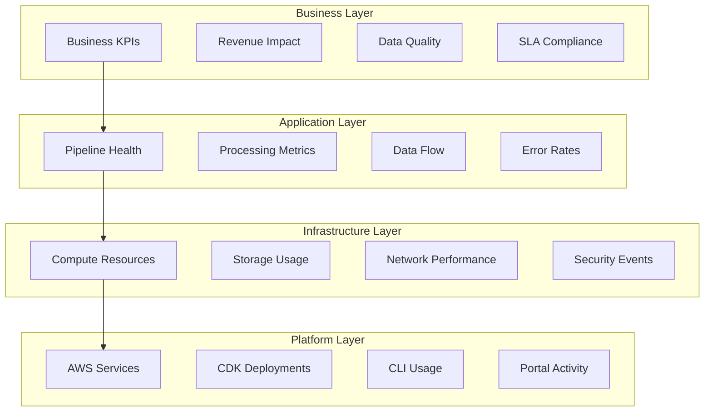

# Monitoring and Alerting Operations Guide

Comprehensive guide for monitoring, alerting, and maintaining the DevSecOps Platform in production environments.

## Overview

This guide covers operational monitoring practices, alerting strategies, and maintenance procedures for ensuring optimal platform performance and reliability.

## Monitoring Strategy

### 1. Multi-Layer Monitoring



### 2. Key Performance Indicators

#### Business KPIs
- **Data Processing SLA**: 99.9% uptime target
- **Data Quality Score**: >95% quality threshold
- **Time to Insight**: <4 hours for critical data
- **Cost Efficiency**: Cost per processed record
- **User Satisfaction**: Platform adoption and usage metrics

#### Technical KPIs
- **System Availability**: 99.9% uptime
- **Error Rate**: <0.1% error rate
- **Processing Latency**: <5 minutes for batch, <30 seconds for streaming
- **Resource Utilization**: 70-80% optimal range
- **Security Incidents**: Zero tolerance for high-severity incidents

## Monitoring Implementation

### 1. CloudWatch Configuration

```bash
# Deploy monitoring stack
ddk-cli deploy --stack MonitoringStack --env prod

# Configure custom metrics
aws cloudwatch put-metric-data \
  --namespace "Platform/Business" \
  --metric-data MetricName=DataQualityScore,Value=98.5,Unit=Percent

# Set up log insights queries
aws logs start-query \
  --log-group-name "/aws/lambda/data-processor" \
  --start-time 1640995200 \
  --end-time 1641081600 \
  --query-string 'fields @timestamp, @message | filter @message like /ERROR/'
```

### 2. Custom Dashboards

#### Infrastructure Dashboard
```python
# Create comprehensive infrastructure dashboard
infrastructure_dashboard = cloudwatch.Dashboard(
    self,
    "InfrastructureDashboard",
    dashboard_name="platform-infrastructure"
)

# Add widgets for key metrics
infrastructure_dashboard.add_widgets(
    # Lambda performance
    cloudwatch.GraphWidget(
        title="Lambda Function Performance",
        left=[
            cloudwatch.Metric(
                namespace="AWS/Lambda",
                metric_name="Duration",
                statistic="Average"
            )
        ],
        right=[
            cloudwatch.Metric(
                namespace="AWS/Lambda",
                metric_name="Errors",
                statistic="Sum"
            )
        ]
    ),
    
    # S3 usage
    cloudwatch.GraphWidget(
        title="S3 Storage Usage",
        left=[
            cloudwatch.Metric(
                namespace="AWS/S3",
                metric_name="BucketSizeBytes",
                statistic="Average"
            )
        ]
    ),
    
    # RDS performance
    cloudwatch.GraphWidget(
        title="Database Performance",
        left=[
            cloudwatch.Metric(
                namespace="AWS/RDS",
                metric_name="CPUUtilization",
                statistic="Average"
            )
        ],
        right=[
            cloudwatch.Metric(
                namespace="AWS/RDS",
                metric_name="DatabaseConnections",
                statistic="Average"
            )
        ]
    )
)
```

#### Business Dashboard
```python
# Business metrics dashboard
business_dashboard = cloudwatch.Dashboard(
    self,
    "BusinessDashboard",
    dashboard_name="platform-business"
)

business_dashboard.add_widgets(
    # Data quality metrics
    cloudwatch.SingleValueWidget(
        title="Data Quality Score",
        metrics=[
            cloudwatch.Metric(
                namespace="Platform/Quality",
                metric_name="OverallQualityScore",
                statistic="Average"
            )
        ]
    ),
    
    # Processing volume
    cloudwatch.GraphWidget(
        title="Daily Processing Volume",
        left=[
            cloudwatch.Metric(
                namespace="Platform/Processing",
                metric_name="RecordsProcessed",
                statistic="Sum"
            )
        ]
    ),
    
    # Cost tracking
    cloudwatch.GraphWidget(
        title="Daily Costs",
        left=[
            cloudwatch.Metric(
                namespace="Platform/Cost",
                metric_name="DailyCost",
                statistic="Sum"
            )
        ]
    )
)
```

### 3. Log Management

#### Centralized Logging
```bash
# Configure log aggregation
aws logs create-log-group --log-group-name "/platform/aggregated"

# Set up log streams
aws logs create-log-stream \
  --log-group-name "/platform/aggregated" \
  --log-stream-name "application-logs"

# Configure log retention
aws logs put-retention-policy \
  --log-group-name "/platform/aggregated" \
  --retention-in-days 30
```

#### Log Analysis Queries
```sql
-- Error analysis query
fields @timestamp, level, message, error_type, pipeline
| filter level = "ERROR"
| stats count() by error_type, pipeline
| sort count desc

-- Performance analysis query
fields @timestamp, duration, pipeline, environment
| filter message like /processing completed/
| stats avg(duration), max(duration), min(duration) by pipeline, environment

-- Business metrics query
fields @timestamp, records_processed, data_quality_score, pipeline
| filter message like /batch completed/
| stats sum(records_processed), avg(data_quality_score) by pipeline
```

## Alerting Configuration

### 1. Alert Hierarchy

```mermaid
graph TB
    subgraph "Critical Alerts"
        SystemDown[System Down]
        DataLoss[Data Loss]
        SecurityBreach[Security Breach]
        ComplianceViolation[Compliance Violation]
    end
    
    subgraph "Warning Alerts"
        HighErrorRate[High Error Rate]
        PerformanceDegradation[Performance Issues]
        ResourceExhaustion[Resource Limits]
        CostThreshold[Cost Threshold]
    end
    
    subgraph "Info Alerts"
        DeploymentComplete[Deployment Complete]
        MaintenanceScheduled[Maintenance Window]
        UsageReports[Usage Reports]
        HealthChecks[Health Check Results]
    end
    
    SystemDown --> PagerDuty[PagerDuty]
    DataLoss --> PagerDuty
    SecurityBreach --> PagerDuty
    
    HighErrorRate --> Slack[Slack Channel]
    PerformanceDegradation --> Slack
    ResourceExhaustion --> Slack
    
    DeploymentComplete --> Email[Email Notifications]
    MaintenanceScheduled --> Email
```



### 2. Alert Configuration

#### Critical Alerts
```python
# System availability alarm
system_availability_alarm = cloudwatch.Alarm(
    self,
    "SystemAvailabilityAlarm",
    metric=cloudwatch.Metric(
        namespace="Platform/Health",
        metric_name="SystemAvailability",
        statistic="Average"
    ),
    threshold=99.0,
    evaluation_periods=2,
    comparison_operator=cloudwatch.ComparisonOperator.LESS_THAN_THRESHOLD,
    alarm_description="System availability below 99%",
    alarm_actions=[
        pagerduty_topic,
        critical_slack_topic,
        email_topic
    ],
    treat_missing_data=cloudwatch.TreatMissingData.BREACHING
)

# Data loss detection alarm
data_loss_alarm = cloudwatch.Alarm(
    self,
    "DataLossAlarm",
    metric=cloudwatch.Metric(
        namespace="Platform/Data",
        metric_name="DataLossEvents",
        statistic="Sum"
    ),
    threshold=1,
    evaluation_periods=1,
    comparison_operator=cloudwatch.ComparisonOperator.GREATER_THAN_OR_EQUAL_TO_THRESHOLD,
    alarm_description="Data loss event detected",
    alarm_actions=[
        pagerduty_topic,
        critical_slack_topic,
        security_team_topic
    ]
)
```

#### Performance Alerts
```python
# High error rate alarm
error_rate_alarm = cloudwatch.Alarm(
    self,
    "HighErrorRateAlarm",
    metric=cloudwatch.MathExpression(
        expression="errors / invocations * 100",
        using_metrics={
            "errors": cloudwatch.Metric(
                namespace="AWS/Lambda",
                metric_name="Errors",
                statistic="Sum"
            ),
            "invocations": cloudwatch.Metric(
                namespace="AWS/Lambda",
                metric_name="Invocations",
                statistic="Sum"
            )
        }
    ),
    threshold=1.0,  # 1% error rate
    evaluation_periods=3,
    comparison_operator=cloudwatch.ComparisonOperator.GREATER_THAN_THRESHOLD,
    alarm_description="Lambda error rate above 1%",
    alarm_actions=[warning_slack_topic, email_topic]
)

# Processing latency alarm
latency_alarm = cloudwatch.Alarm(
    self,
    "ProcessingLatencyAlarm",
    metric=cloudwatch.Metric(
        namespace="Platform/Processing",
        metric_name="ProcessingLatency",
        statistic="Average"
    ),
    threshold=300,  # 5 minutes
    evaluation_periods=2,
    comparison_operator=cloudwatch.ComparisonOperator.GREATER_THAN_THRESHOLD,
    alarm_description="Processing latency above 5 minutes",
    alarm_actions=[warning_slack_topic]
)
```

### 3. Notification Channels

#### Slack Integration
```python
# Slack notification Lambda
slack_notifier = lambda_.Function(
    self,
    "SlackNotifier",
    runtime=lambda_.Runtime.PYTHON_3_9,
    handler="slack_notifier.handler",
    code=lambda_.Code.from_asset("src/notifications"),
    environment={
        "SLACK_WEBHOOK_URL": slack_webhook_url,
        "SLACK_CHANNEL": "#platform-alerts"
    }
)

# SNS topic for Slack notifications
slack_topic = sns.Topic(
    self,
    "SlackNotifications",
    topic_name="platform-slack-alerts"
)

slack_topic.add_subscription(
    sns_subscriptions.LambdaSubscription(slack_notifier)
)
```

#### Email Notifications
```python
# Email notification setup
email_topic = sns.Topic(
    self,
    "EmailNotifications",
    topic_name="platform-email-alerts"
)

# Add email subscriptions
email_addresses = [
    "platform-team@company.com",
    "oncall@company.com",
    "security-team@company.com"
]

for email in email_addresses:
    email_topic.add_subscription(
        sns_subscriptions.EmailSubscription(email)
    )
```

#### PagerDuty Integration
```python
# PagerDuty integration
pagerduty_topic = sns.Topic(
    self,
    "PagerDutyNotifications",
    topic_name="platform-pagerduty-alerts"
)

# PagerDuty webhook
pagerduty_webhook = lambda_.Function(
    self,
    "PagerDutyWebhook",
    runtime=lambda_.Runtime.PYTHON_3_9,
    handler="pagerduty_webhook.handler",
    code=lambda_.Code.from_asset("src/notifications"),
    environment={
        "PAGERDUTY_INTEGRATION_KEY": pagerduty_key,
        "PAGERDUTY_SERVICE_ID": pagerduty_service_id
    }
)

pagerduty_topic.add_subscription(
    sns_subscriptions.LambdaSubscription(pagerduty_webhook)
)
```

## Operational Procedures

### 1. Daily Operations

#### Morning Health Check
```bash
#!/bin/bash
# daily-health-check.sh

echo "=== Daily Platform Health Check ==="
echo "Date: $(date)"
echo

# Check system status
echo "1. System Status:"
ddk-cli status --env prod --all

# Check error rates
echo "2. Error Rates (last 24h):"
aws cloudwatch get-metric-statistics \
  --namespace "AWS/Lambda" \
  --metric-name "Errors" \
  --start-time $(date -d '24 hours ago' -u +%Y-%m-%dT%H:%M:%S) \
  --end-time $(date -u +%Y-%m-%dT%H:%M:%S) \
  --period 3600 \
  --statistics Sum

# Check data quality
echo "3. Data Quality Scores:"
aws cloudwatch get-metric-statistics \
  --namespace "Platform/Quality" \
  --metric-name "DataQualityScore" \
  --start-time $(date -d '24 hours ago' -u +%Y-%m-%dT%H:%M:%S) \
  --end-time $(date -u +%Y-%m-%dT%H:%M:%S) \
  --period 3600 \
  --statistics Average

# Check costs
echo "4. Daily Costs:"
aws ce get-cost-and-usage \
  --time-period Start=$(date -d '1 day ago' +%Y-%m-%d),End=$(date +%Y-%m-%d) \
  --granularity DAILY \
  --metrics BlendedCost

echo "=== Health Check Complete ==="
```

#### Performance Review
```bash
#!/bin/bash
# performance-review.sh

echo "=== Performance Review ==="

# Lambda performance
echo "Lambda Function Performance:"
aws logs start-query \
  --log-group-name "/aws/lambda/data-processor" \
  --start-time $(date -d '24 hours ago' +%s) \
  --end-time $(date +%s) \
  --query-string 'fields @timestamp, @duration | stats avg(@duration), max(@duration), min(@duration)'

# Data processing metrics
echo "Data Processing Metrics:"
aws cloudwatch get-metric-statistics \
  --namespace "Platform/Processing" \
  --metric-name "ProcessingLatency" \
  --start-time $(date -d '24 hours ago' -u +%Y-%m-%dT%H:%M:%S) \
  --end-time $(date -u +%Y-%m-%dT%H:%M:%S) \
  --period 3600 \
  --statistics Average,Maximum

# Resource utilization
echo "Resource Utilization:"
aws cloudwatch get-metric-statistics \
  --namespace "AWS/ECS" \
  --metric-name "CPUUtilization" \
  --start-time $(date -d '24 hours ago' -u +%Y-%m-%dT%H:%M:%S) \
  --end-time $(date -u +%Y-%m-%dT%H:%M:%S) \
  --period 3600 \
  --statistics Average
```

### 2. Weekly Operations

#### Weekly Report Generation
```python
# weekly-report.py
import boto3
import json
from datetime import datetime, timedelta

class WeeklyReportGenerator:
    def __init__(self):
        self.cloudwatch = boto3.client('cloudwatch')
        self.ce = boto3.client('ce')
        
    def generate_report(self):
        """Generate comprehensive weekly report."""
        end_time = datetime.utcnow()
        start_time = end_time - timedelta(days=7)
        
        report = {
            "period": {
                "start": start_time.isoformat(),
                "end": end_time.isoformat()
            },
            "system_health": self.get_system_health(start_time, end_time),
            "performance_metrics": self.get_performance_metrics(start_time, end_time),
            "cost_analysis": self.get_cost_analysis(start_time, end_time),
            "security_summary": self.get_security_summary(start_time, end_time),
            "recommendations": self.get_recommendations()
        }
        
        return report
    
    def get_system_health(self, start_time, end_time):
        """Get system health metrics."""
        # Implementation for system health metrics
        pass
    
    def get_performance_metrics(self, start_time, end_time):
        """Get performance metrics."""
        # Implementation for performance metrics
        pass
    
    def get_cost_analysis(self, start_time, end_time):
        """Get cost analysis."""
        # Implementation for cost analysis
        pass
    
    def get_security_summary(self, start_time, end_time):
        """Get security summary."""
        # Implementation for security summary
        pass
    
    def get_recommendations(self):
        """Get optimization recommendations."""
        # Implementation for recommendations
        pass

# Generate and send weekly report
if __name__ == "__main__":
    generator = WeeklyReportGenerator()
    report = generator.generate_report()
    
    # Send report via email/Slack
    print(json.dumps(report, indent=2))
```

### 3. Incident Response

#### Incident Response Playbook
```bash
#!/bin/bash
# incident-response.sh

INCIDENT_TYPE=$1
SEVERITY=$2

echo "=== Incident Response Activated ==="
echo "Type: $INCIDENT_TYPE"
echo "Severity: $SEVERITY"
echo "Time: $(date)"

case $INCIDENT_TYPE in
    "system-down")
        echo "Executing system down response..."
        # Check system status
        ddk-cli status --env prod --detailed
        
        # Check recent deployments
        aws cloudformation describe-stacks --stack-name PlatformStack-prod
        
        # Check CloudTrail for recent changes
        aws logs filter-log-events \
          --log-group-name CloudTrail/PlatformLogs \
          --start-time $(date -d '1 hour ago' +%s)000
        ;;
        
    "high-error-rate")
        echo "Executing high error rate response..."
        # Get recent errors
        aws logs filter-log-events \
          --log-group-name "/aws/lambda/data-processor" \
          --filter-pattern "ERROR" \
          --start-time $(date -d '1 hour ago' +%s)000
        
        # Check Lambda metrics
        aws cloudwatch get-metric-statistics \
          --namespace "AWS/Lambda" \
          --metric-name "Errors" \
          --start-time $(date -d '1 hour ago' -u +%Y-%m-%dT%H:%M:%S) \
          --end-time $(date -u +%Y-%m-%dT%H:%M:%S) \
          --period 300 \
          --statistics Sum
        ;;
        
    "data-quality")
        echo "Executing data quality incident response..."
        # Check data quality metrics
        aws cloudwatch get-metric-statistics \
          --namespace "Platform/Quality" \
          --metric-name "DataQualityScore" \
          --start-time $(date -d '4 hours ago' -u +%Y-%m-%dT%H:%M:%S) \
          --end-time $(date -u +%Y-%m-%dT%H:%M:%S) \
          --period 900 \
          --statistics Average
        
        # Check data validation logs
        aws logs filter-log-events \
          --log-group-name "/aws/lambda/data-validator" \
          --filter-pattern "VALIDATION_FAILED" \
          --start-time $(date -d '4 hours ago' +%s)000
        ;;
esac

echo "=== Incident Response Complete ==="
```

## Maintenance Procedures

### 1. Scheduled Maintenance

#### Monthly Maintenance Window
```bash
#!/bin/bash
# monthly-maintenance.sh

echo "=== Monthly Maintenance Window ==="
echo "Starting maintenance at $(date)"

# 1. Update dependencies
echo "Updating dependencies..."
pip install --upgrade ddk-cli
npm update -g aws-cdk

# 2. Security patches
echo "Applying security patches..."
ddk-cli security update --env prod

# 3. Performance optimization
echo "Running performance optimization..."
ddk-cli optimize --env prod

# 4. Backup verification
echo "Verifying backups..."
aws backup describe-backup-jobs --by-state COMPLETED

# 5. Certificate renewal
echo "Checking certificate expiration..."
aws acm list-certificates --certificate-statuses ISSUED

# 6. Cost optimization
echo "Running cost optimization..."
ddk-cli cost optimize --env prod

echo "Maintenance window completed at $(date)"
```

### 2. Capacity Planning

#### Resource Usage Analysis
```python
# capacity-planning.py
import boto3
from datetime import datetime, timedelta

class CapacityPlanner:
    def __init__(self):
        self.cloudwatch = boto3.client('cloudwatch')
        self.ce = boto3.client('ce')
    
    def analyze_trends(self, days=30):
        """Analyze resource usage trends."""
        end_time = datetime.utcnow()
        start_time = end_time - timedelta(days=days)
        
        # Analyze Lambda usage
        lambda_metrics = self.get_lambda_trends(start_time, end_time)
        
        # Analyze storage growth
        storage_metrics = self.get_storage_trends(start_time, end_time)
        
        # Analyze cost trends
        cost_metrics = self.get_cost_trends(start_time, end_time)
        
        return {
            "lambda": lambda_metrics,
            "storage": storage_metrics,
            "cost": cost_metrics,
            "recommendations": self.generate_recommendations()
        }
    
    def get_lambda_trends(self, start_time, end_time):
        """Get Lambda usage trends."""
        # Implementation for Lambda trends
        pass
    
    def get_storage_trends(self, start_time, end_time):
        """Get storage growth trends."""
        # Implementation for storage trends
        pass
    
    def get_cost_trends(self, start_time, end_time):
        """Get cost trends."""
        # Implementation for cost trends
        pass
    
    def generate_recommendations(self):
        """Generate capacity recommendations."""
        # Implementation for recommendations
        pass
```

## Best Practices

### 1. Monitoring Best Practices

- **Proactive Monitoring**: Monitor leading indicators, not just lagging ones
- **Baseline Establishment**: Establish performance baselines for comparison
- **Alert Fatigue Prevention**: Tune alerts to reduce false positives
- **Documentation**: Document all monitoring procedures and runbooks
- **Regular Reviews**: Regularly review and update monitoring configurations

### 2. Alerting Best Practices

- **Severity Classification**: Clearly define alert severity levels
- **Escalation Procedures**: Implement clear escalation paths
- **Response Time SLAs**: Define response time expectations
- **Post-Incident Reviews**: Conduct reviews after incidents
- **Continuous Improvement**: Regularly improve alerting based on feedback

### 3. Operational Best Practices

- **Automation**: Automate routine operational tasks
- **Documentation**: Maintain up-to-date operational documentation
- **Training**: Ensure team members are trained on procedures
- **Testing**: Regularly test monitoring and alerting systems
- **Communication**: Maintain clear communication channels

For more information, see:
- [Architecture Monitoring](../architecture/monitoring.md)
- [Troubleshooting Guide](troubleshooting.md)
- [Security Monitoring](../security/overview.md)
- [Cost Optimization](cost-optimization.md)
