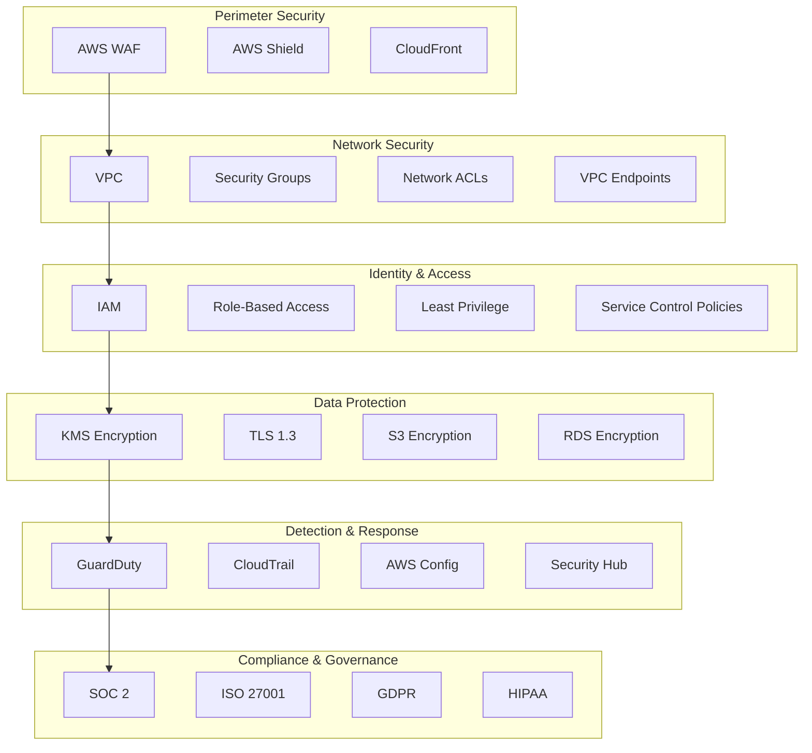

# Security Overview

The DevSecOps Platform implements a comprehensive security framework based on industry best practices, regulatory requirements, and the AWS Well-Architected Framework.

## Security Architecture

### Defense in Depth

The platform implements multiple layers of security controls:



### Security Controls by Layer

#### 1. Perimeter Security

- **AWS WAF**: Web Application Firewall with managed rules
- **AWS Shield**: DDoS protection
- **CloudFront**: Edge security and content delivery

#### 2. Network Security

- **VPC Isolation**: Separate VPCs for each environment
- **Security Groups**: Stateful firewall rules
- **Network ACLs**: Stateless network filtering
- **VPC Endpoints**: Private access to AWS services
- **VPC Flow Logs**: Network traffic monitoring

#### 3. Identity and Access Management

- **IAM Roles**: Role-based access control
- **Least Privilege**: Minimal required permissions
- **MFA**: Multi-factor authentication
- **Service Control Policies**: Account-level guardrails
- **IAM Access Analyzer**: Permission analysis

#### 4. Data Protection

- **KMS Encryption**: All data encrypted at rest
- **TLS 1.3**: Secure data in transit
- **S3 Bucket Policies**: Secure object storage
- **RDS Encryption**: Database encryption
- **Secrets Manager**: Secure secrets storage

#### 5. Detection and Response

- **GuardDuty**: Threat detection
- **CloudTrail**: API activity logging
- **AWS Config**: Configuration compliance
- **Security Hub**: Security posture management
- **EventBridge**: Security event automation

#### 6. Compliance and Governance

- **SOC 2**: Service Organization Controls
- **ISO 27001**: Information security management
- **GDPR**: Data protection and privacy
- **HIPAA**: Healthcare data protection (if applicable)

## Security-by-Design Principles

### 1. Zero Trust Architecture

- **Never Trust, Always Verify**: All access requires authentication and authorization
- **Micro-Segmentation**: Fine-grained network segmentation
- **Continuous Verification**: Ongoing validation of security posture

### 2. Least Privilege Access

- **Minimal Permissions**: Only required permissions granted
- **Just-in-Time Access**: Temporary elevated permissions
- **Regular Access Reviews**: Periodic permission reviews

### 3. Immutable Infrastructure

- **Infrastructure as Code**: All infrastructure defined as code
- **Immutable Deployments**: No modifications to running resources
- **Version Control**: All changes tracked in Git

### 4. Secure CI/CD Pipeline

- **Code Scanning**: Automated code security analysis
- **Dependency Scanning**: Third-party library vulnerability scanning
- **Infrastructure Scanning**: IaC security validation
- **Container Scanning**: Docker image security scanning

## Security Scanning and Compliance

### Security Scanner

The platform includes a comprehensive security scanner that performs:

```bash
# Run comprehensive security scan
python security/scanner.py scan . --type all --output security-report.json
```

#### Scanner Components

1. **SAST (Static Application Security Testing)**:
   - **Bandit**: Python code security analysis
   - **Semgrep**: Multi-language pattern-based scanning
   - **Custom Rules**: Organization-specific security rules

2. **Dependency Scanning**:
   - **Safety**: Python dependency vulnerabilities
   - **pip-audit**: Python package vulnerabilities
   - **npm audit**: JavaScript package vulnerabilities (if applicable)

3. **Infrastructure Scanning**:
   - **Checkov**: IaC security scanning
   - **cfn-lint**: CloudFormation template validation
   - **cdk-nag**: CDK security best practices

4. **Secrets Detection**:
   - **detect-secrets**: Hardcoded secrets detection
   - **git-secrets**: Git history secrets scanning

### Compliance Automation

The platform automates compliance checks for multiple frameworks:

```bash
# Check SOC 2 compliance
python security/compliance.py check --framework SOC2

# Check multiple frameworks
python security/compliance.py check --framework SOC2 --framework ISO27001 --framework GDPR
```

#### Compliance Frameworks

1. **SOC 2 Type II**:
   - Access controls and user management
   - System monitoring and logging
   - Change management processes
   - Data protection and privacy
   - Incident response procedures

2. **ISO 27001**:
   - Information security policies
   - Risk management processes
   - Asset management and inventory
   - Access control management
   - Cryptographic controls

3. **GDPR**:
   - Data protection by design
   - Privacy impact assessments
   - Data subject rights management
   - Breach notification procedures
   - International data transfers

## Security Monitoring and Incident Response

### Security Monitoring

- **Real-time Alerts**: Immediate notification of security events
- **Security Dashboards**: Security posture visualization
- **Compliance Dashboards**: Compliance status tracking
- **Threat Intelligence**: Integration with threat feeds

### Incident Response

1. **Detection**: Automated detection of security incidents
2. **Analysis**: Rapid triage and impact assessment
3. **Containment**: Isolation of affected resources
4. **Eradication**: Removal of threat actors
5. **Recovery**: Restoration of services
6. **Lessons Learned**: Post-incident analysis and improvement

## Data Protection and Privacy

### Data Classification

| Classification | Description | Examples | Controls |
|----------------|-------------|----------|----------|
| **Public** | Information that can be freely disclosed | Marketing materials, public documentation | Basic protection |
| **Internal** | Information for internal use only | Internal processes, non-sensitive configurations | Standard protection |
| **Confidential** | Sensitive business information | Customer data, financial information | Enhanced protection |
| **Restricted** | Highly sensitive information | PII, PHI, authentication credentials | Maximum protection |

### Privacy Controls

- **Data Minimization**: Collect only necessary data
- **Purpose Limitation**: Use data only for specified purposes
- **Storage Limitation**: Retain data only as long as necessary
- **Data Subject Rights**: Support for access, rectification, erasure
- **Privacy Impact Assessments**: Evaluate privacy implications

## Security Best Practices

### For Developers

1. **Secure Coding**:
   - Input validation and output encoding
   - Parameterized queries for database access
   - Proper error handling and logging
   - Secure dependency management

2. **Authentication and Authorization**:
   - Strong password policies
   - Multi-factor authentication
   - Token-based authentication
   - Role-based access control

3. **Data Protection**:
   - Encryption for sensitive data
   - Secure data transmission
   - Proper data sanitization
   - Secure data deletion

### For Operations

1. **Infrastructure Security**:
   - Regular patching and updates
   - Secure configuration management
   - Network segmentation
   - Endpoint protection

2. **Monitoring and Logging**:
   - Centralized log management
   - Security event monitoring
   - Anomaly detection
   - Audit logging

3. **Incident Response**:
   - Incident response plan
   - Regular tabletop exercises
   - Post-incident analysis
   - Continuous improvement

## Security Documentation

### Security Policies

- **Information Security Policy**: Overall security governance
- **Access Control Policy**: User access management
- **Data Protection Policy**: Data handling requirements
- **Incident Response Policy**: Security incident procedures
- **Change Management Policy**: Secure change processes

### Security Procedures

- **User Access Management**: Provisioning and deprovisioning
- **Vulnerability Management**: Scanning and remediation
- **Patch Management**: System updates and patching
- **Backup and Recovery**: Data protection procedures
- **Security Monitoring**: Alert handling and escalation

## Security Training and Awareness

- **Security Awareness Training**: Regular security education
- **Secure Coding Training**: Developer-specific security training
- **Phishing Simulations**: Social engineering awareness
- **Security Champions**: Embedded security expertise

## Additional Resources

- [AWS Security Best Practices](https://aws.amazon.com/architecture/security-identity-compliance/)
- [OWASP Top 10](https://owasp.org/www-project-top-ten/)
- [NIST Cybersecurity Framework](https://www.nist.gov/cyberframework)
- [CIS AWS Foundations Benchmark](https://www.cisecurity.org/benchmark/amazon_web_services/)

For detailed security implementation, see the [Security Implementation Guide](implementation.md).
