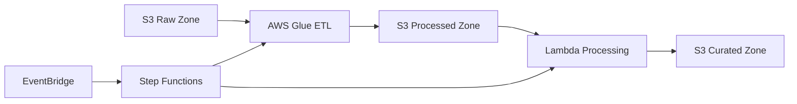
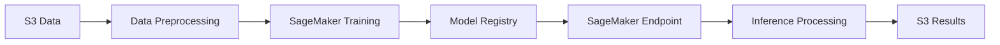
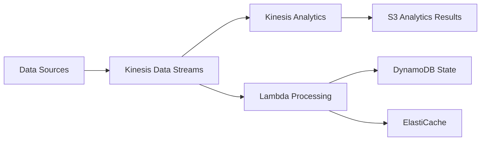
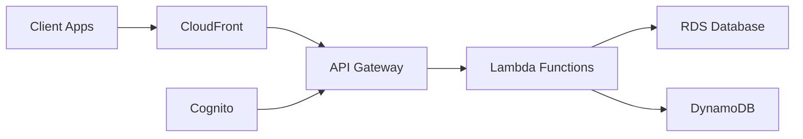

# Project Templates Guide

Complete guide to using and customizing project templates in the DevSecOps Platform.

## Overview

Project templates provide pre-configured, best-practice implementations for common data engineering and ML patterns. Each template includes:

- **Infrastructure as Code**: Complete AWS CDK implementation
- **Security Controls**: Built-in security and compliance features
- **CI/CD Pipelines**: GitHub Actions workflows
- **Monitoring**: CloudWatch dashboards and alerting
- **Documentation**: Comprehensive project documentation

## Available Templates

### Data Pipeline Template

**Template Name**: `data-pipeline`  
**Description**: ETL/ELT data processing pipeline with AWS Glue and Lambda  
**Use Cases**: Batch data processing, data transformation, data lake ingestion

**Features**:
- S3-based data lake with raw, processed, and curated zones
- AWS Glue for ETL jobs and data cataloging
- Lambda functions for data processing and orchestration
- Step Functions for workflow orchestration
- EventBridge for event-driven processing
- Built-in data quality checks

**Architecture**:


**Configuration Options**:
```json
{
  "data_source_type": ["s3", "rds", "dynamodb", "api"],
  "processing_engine": ["glue", "lambda", "emr"],
  "output_format": ["parquet", "csv", "json", "delta"],
  "enable_streaming": ["yes", "no"],
  "data_quality_checks": ["yes", "no"]
}
```

### ML Workflow Template

**Template Name**: `ml-workflow`  
**Description**: Machine learning training and inference pipeline  
**Use Cases**: Model training, batch inference, model deployment

**Features**:
- SageMaker for model training and hosting
- MLflow for experiment tracking and model registry
- Lambda functions for data preprocessing and postprocessing
- Step Functions for ML workflow orchestration
- Model versioning and A/B testing capabilities
- Automated model monitoring and drift detection

**Architecture**:


**Configuration Options**:
```json
{
  "ml_framework": ["scikit-learn", "tensorflow", "pytorch", "xgboost"],
  "instance_type": ["ml.m5.large", "ml.m5.xlarge", "ml.p3.2xlarge"],
  "enable_auto_scaling": ["yes", "no"],
  "enable_model_monitoring": ["yes", "no"],
  "deployment_strategy": ["blue-green", "canary", "rolling"]
}
```

### Streaming Template

**Template Name**: `streaming`  
**Description**: Real-time data streaming and processing pipeline  
**Use Cases**: Real-time analytics, event processing, streaming ETL

**Features**:
- Kinesis Data Streams for real-time data ingestion
- Kinesis Analytics for stream processing
- Lambda functions for real-time processing
- DynamoDB for state management
- ElastiCache for caching and session storage
- Real-time dashboards and alerting

**Architecture**:


**Configuration Options**:
```json
{
  "stream_processing": ["kinesis-analytics", "lambda", "flink"],
  "shard_count": [1, 2, 4, 8],
  "retention_period": [24, 168, 8760],
  "enable_enhanced_fanout": ["yes", "no"],
  "output_destinations": ["s3", "dynamodb", "elasticsearch"]
}
```

### API Service Template

**Template Name**: `api-service`  
**Description**: REST API service with database backend  
**Use Cases**: Data APIs, microservices, web applications

**Features**:
- API Gateway for REST API management
- Lambda functions for business logic
- RDS or DynamoDB for data storage
- Cognito for authentication and authorization
- CloudFront for global distribution
- Comprehensive API documentation

**Architecture**:


**Configuration Options**:
```json
{
  "database_type": ["rds-postgresql", "rds-mysql", "dynamodb"],
  "authentication": ["cognito", "api-key", "iam"],
  "api_documentation": ["swagger", "openapi"],
  "enable_caching": ["yes", "no"],
  "cors_enabled": ["yes", "no"]
}
```

## Using Templates

### Create Project from Template

```bash
# Basic usage
ddk-cli create-project my-pipeline --template data-pipeline

# With custom configuration
ddk-cli create-project my-ml-model \
  --template ml-workflow \
  --config ml_framework=tensorflow \
  --config instance_type=ml.p3.2xlarge
```

### Interactive Template Selection

```bash
# Interactive project creation
ddk-cli create-project my-project --interactive
```

This will prompt you to:
1. Select a template
2. Configure template parameters
3. Set project metadata
4. Choose deployment options

### Template Configuration

Templates use cookiecutter for configuration. You can provide configuration in several ways:

#### 1. Command Line Arguments

```bash
ddk-cli create-project my-pipeline \
  --template data-pipeline \
  --config data_source_type=s3 \
  --config processing_engine=glue \
  --config output_format=parquet
```

#### 2. Configuration File

Create a `template-config.yaml` file:

```yaml
project_name: my-pipeline
data_source_type: s3
processing_engine: glue
output_format: parquet
enable_streaming: no
data_quality_checks: yes
```

Then use it:

```bash
ddk-cli create-project my-pipeline \
  --template data-pipeline \
  --config-file template-config.yaml
```

#### 3. Interactive Mode

```bash
ddk-cli create-project my-pipeline --template data-pipeline --interactive
```

## Customizing Templates

### Template Structure

Templates are organized using cookiecutter structure:

```
templates/my-template/
├── cookiecutter.json           # Template configuration
├── {{ cookiecutter.project_slug }}/  # Template directory
│   ├── README.md
│   ├── app.py
│   ├── cdk.json
│   ├── requirements.txt
│   ├── infrastructure/
│   │   ├── stacks/
│   │   └── constructs/
│   ├── src/
│   └── tests/
└── hooks/                      # Template hooks
    ├── pre_gen_project.py
    └── post_gen_project.py
```

### Creating Custom Templates

#### 1. Copy Existing Template

```bash
# Copy and modify existing template
cp -r templates/data-pipeline templates/my-custom-template
cd templates/my-custom-template
```

#### 2. Update Configuration

Edit `cookiecutter.json`:

```json
{
  "project_name": "My Custom Project",
  "project_slug": "{{ cookiecutter.project_name|lower|replace(' ', '-') }}",
  "project_description": "Custom project template",
  "author_name": "Your Name",
  "author_email": "your.email@company.com",
  "aws_region": "us-east-1",
  "custom_parameter": ["option1", "option2", "option3"],
  "enable_feature": ["yes", "no"]
}
```

#### 3. Customize Template Files

Use cookiecutter variables in your template files:

```python
# app.py
#!/usr/bin/env python3

import aws_cdk as cdk
from infrastructure.stacks.{{ cookiecutter.project_slug }}_stack import {{ cookiecutter.project_name|title|replace(' ', '') }}Stack

app = cdk.App()

{{ cookiecutter.project_name|title|replace(' ', '') }}Stack(
    app,
    "{{ cookiecutter.project_slug }}-stack",
    env=cdk.Environment(
        account=app.node.try_get_context("account"),
        region="{{ cookiecutter.aws_region }}"
    )
)

app.synth()
```

#### 4. Add Template Hooks

Create pre/post generation hooks:

```python
# hooks/pre_gen_project.py
import re
import sys

# Validate project name
MODULE_REGEX = r'^[a-z][a-z0-9\-_]+$'
project_slug = '{{ cookiecutter.project_slug }}'

if not re.match(MODULE_REGEX, project_slug):
    print(f'ERROR: {project_slug} is not a valid project name!')
    sys.exit(1)
```

```python
# hooks/post_gen_project.py
import os
import subprocess

# Initialize git repository
subprocess.run(['git', 'init'])
subprocess.run(['git', 'add', '.'])
subprocess.run(['git', 'commit', '-m', 'Initial project structure'])

# Install dependencies
subprocess.run(['pip', 'install', '-r', 'requirements.txt'])

print("✅ Project created successfully!")
print("Next steps:")
print("1. cd {{ cookiecutter.project_slug }}")
print("2. ddk-cli deploy --env dev")
```

### Template Best Practices

#### 1. Configuration Design

- **Provide Sensible Defaults**: Choose defaults that work for most use cases
- **Use Validation**: Validate configuration parameters in hooks
- **Document Parameters**: Include clear descriptions for all parameters
- **Group Related Options**: Organize parameters logically

#### 2. Infrastructure Design

- **Follow AWS Well-Architected**: Implement security, reliability, and cost optimization
- **Use Least Privilege**: Apply minimal required permissions
- **Enable Monitoring**: Include CloudWatch dashboards and alarms
- **Plan for Scale**: Design for growth and changing requirements

#### 3. Code Organization

- **Modular Design**: Use reusable constructs and components
- **Clear Structure**: Organize code logically with clear naming
- **Comprehensive Tests**: Include unit, integration, and infrastructure tests
- **Documentation**: Provide clear README and inline documentation

## Template Marketplace

### Sharing Templates

Share templates with your organization:

```bash
# Publish template to organization repository
ddk-cli template publish my-custom-template --org my-org

# Install template from repository
ddk-cli template install my-org/custom-template
```

### Template Versioning

Templates support semantic versioning:

```bash
# Create versioned template
ddk-cli template version my-template --version 1.2.0

# Use specific template version
ddk-cli create-project my-project --template data-pipeline@1.1.0
```

### Template Registry

List and search available templates:

```bash
# List all templates
ddk-cli templates

# Search templates
ddk-cli templates --search ml

# Show template details
ddk-cli template info data-pipeline
```

## Advanced Features

### Conditional Template Logic

Use Jinja2 conditionals in templates:

```python

# Monitoring stack
monitoring_stack = MonitoringStack(
    app,
    "{{ cookiecutter.project_slug }}-monitoring",
    env=env
)

```

### Template Inheritance

Create template hierarchies:

```json
{
  "_template": "base-template",
  "_extensions": ["monitoring", "security"],
  "project_name": "My Project"
}
```

### Dynamic Configuration

Generate configuration based on other parameters:

```python
# hooks/pre_gen_project.py
import json

# Load cookiecutter context
with open('.cookiecutter.json', 'r') as f:
    context = json.load(f)

# Generate dynamic configuration
if context['data_source_type'] == 'rds':
    context['database_required'] = True
    context['vpc_required'] = True
else:
    context['database_required'] = False
    context['vpc_required'] = False

# Save updated context
with open('.cookiecutter.json', 'w') as f:
    json.dump(context, f, indent=2)
```

## Troubleshooting

### Common Issues

#### 1. Template Not Found

```bash
# Check available templates
ddk-cli templates

# Update template cache
ddk-cli template refresh
```

#### 2. Configuration Validation Errors

```bash
# Validate template configuration
ddk-cli template validate my-template

# Check template syntax
cookiecutter --no-input templates/my-template
```

#### 3. Generation Failures

```bash
# Enable verbose output
ddk-cli create-project my-project --template my-template --verbose

# Check template hooks
python templates/my-template/hooks/pre_gen_project.py
```

For more information, see the [CLI Reference](cli.md) and [Developer Guide](../developer-guide/extending.md).
